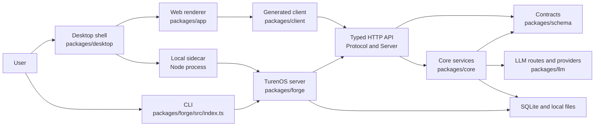
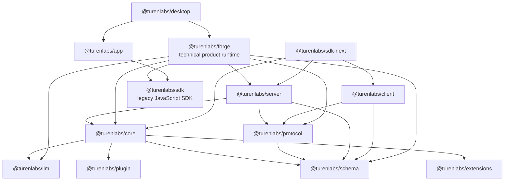
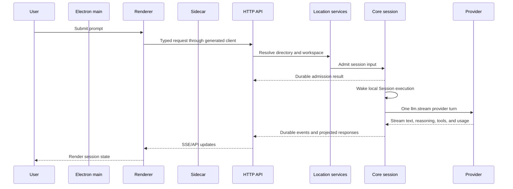
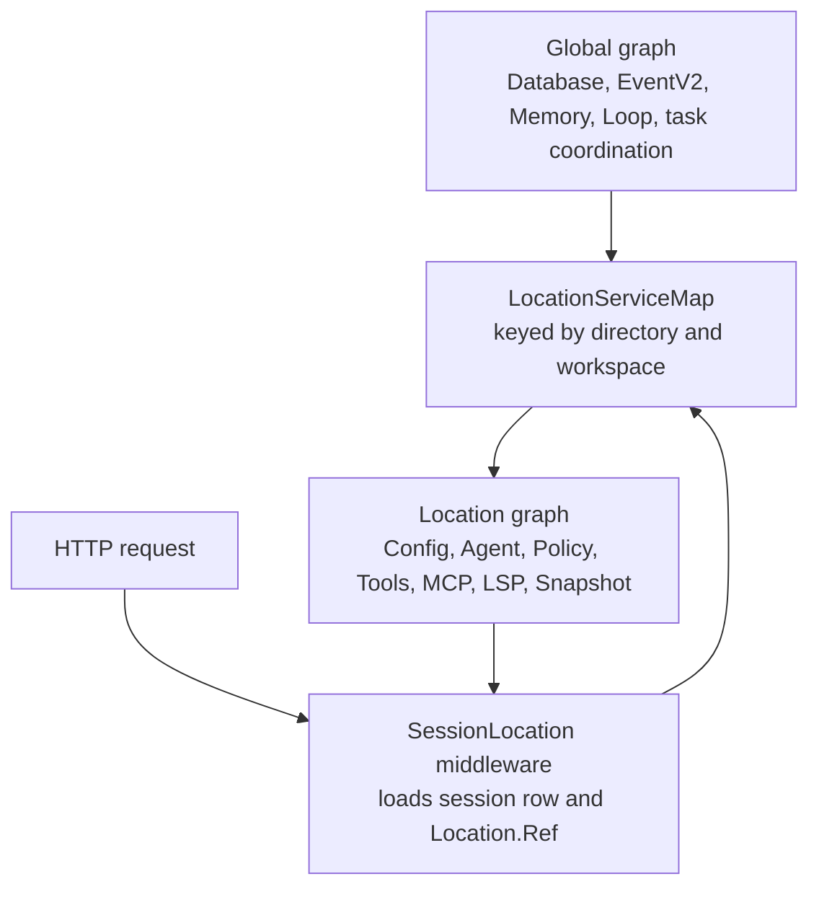
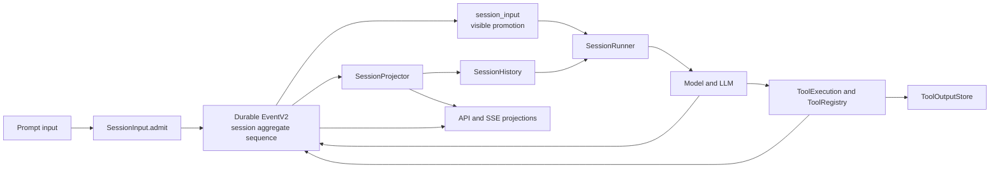
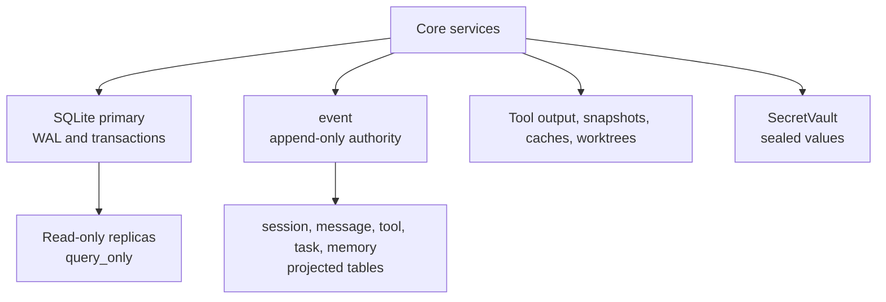
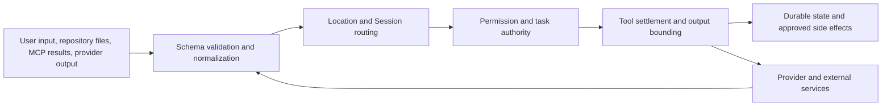

# TurenOS architecture

This document is a source-oriented overview of the current TurenOS runtime. It explains the package
layers, process boundaries, data flow, scope rules, generated artifacts, and operational constraints.
It describes the implementation in this repository, not a proposed hosted architecture.

Names in code blocks and inline code are compatibility identifiers. In particular, `forge`,
`@turenlabs/forge`, `packages/forge`, `FORGE_*`, `.forge`, and `forge.json` are retained exactly;
see [Branding](./branding.md) for the complete policy.

## System shape

The product has two primary entry paths and one shared runtime:

- The desktop shell starts a supervised local sidecar and hosts the web renderer.
- The `forge` CLI starts commands, serves HTTP, or runs an agent without Electron.
- The sidecar and CLI compose the `packages/forge` server with the services in `@turenlabs/core`.

The browser renderer does not call Core services directly. It uses a generated SDK client contract over
HTTP, server-sent events (SSE), and selected WebSocket routes.

The arrows in the package graph below mean "has a runtime dependency on". The package manifests
and the runtime boundary are intentionally separate from source naming compatibility.

### Package responsibilities

| Package                 | Responsibility                                                                                                                              | Source of truth                                                                       |
| ----------------------- | ------------------------------------------------------------------------------------------------------------------------------------------- | ------------------------------------------------------------------------------------- |
| `@turenlabs/schema`     | Effect schemas and stable data contracts for sessions, events, locations, permissions, extensions, tools, and API payloads.                 | [`packages/schema/src/index.ts`](../packages/schema/src/index.ts)                     |
| `@turenlabs/protocol`   | Typed HTTP API groups, middleware slots, errors, and transport schemas. It does not choose concrete Core services.                          | [`packages/protocol/src/api.ts`](../packages/protocol/src/api.ts)                     |
| `@turenlabs/core`       | Shared Effect services, SQLite persistence, durable events, session V2 execution, permissions, memory, tools, and scoped service graphs.    | [`packages/core/src/location-services.ts`](../packages/core/src/location-services.ts) |
| `@turenlabs/server`     | Standard server handlers and route composition for the typed API. It binds Protocol middleware to concrete Core location services.          | [`packages/server/src/routes.ts`](../packages/server/src/routes.ts)                   |
| `@turenlabs/client`     | Client-side API contract and generated Promise and Effect clients. It is the transport boundary for consumers that use this API generation. | [`packages/client/src/contract.ts`](../packages/client/src/contract.ts)               |
| `@turenlabs/sdk`        | Legacy JavaScript SDK, including its generated V2 client and types used by the current renderer.                                            | [`packages/sdk/js/package.json`](../packages/sdk/js/package.json)                     |
| `@turenlabs/llm`        | Provider-neutral messages, streaming events, route transports, provider adapters, and provider protocol implementations.                    | [`packages/llm/src/llm.ts`](../packages/llm/src/llm.ts)                               |
| `@turenlabs/extensions` | Validated catalog manifests and generated catalog data for tools, MCP, data, and skills.                                                    | [`packages/extensions/src/validate.ts`](../packages/extensions/src/validate.ts)       |
| `@turenlabs/plugin`     | Plugin authoring API and V2 Effect and Promise registration surfaces.                                                                       | [`packages/plugin/src/index.ts`](../packages/plugin/src/index.ts)                     |
| `@turenlabs/forge`      | Product composition layer containing the CLI, server, legacy runtime, V2 bridges, security integrations, MCP, and desktop-facing APIs.      | [`packages/forge/src/index.ts`](../packages/forge/src/index.ts)                       |
| `@turenlabs/app`        | Solid renderer and user-facing application pages. It consumes the generated SDK client and UI packages.                                     | [`packages/app/package.json`](../packages/app/package.json)                           |
| `@turenlabs/desktop`    | Electron main process, preload boundary, sidecar supervisor, window security, updater, and packaged analysis assets.                        | [`packages/desktop/src/main/index.ts`](../packages/desktop/src/main/index.ts)         |
| `@turenlabs/sdk-next`   | Composition SDK that combines Client, Core, and Server for integrations that need all three.                                                | [`packages/sdk-next/package.json`](../packages/sdk-next/package.json)                 |

## Process and request flow

The desktop process owns the window and launches the sidecar. The sidecar imports the server only
when it receives a start command, listens on the selected host and port, and reports readiness back
to Electron. The parent-watch path stops an orphaned sidecar rather than leaving a server behind.

The same Core services can be reached by the CLI and by the server without Electron. The desktop
sidecar is therefore a supervisor and transport host, not a second session engine.

The server has two API families:

- `@turenlabs/server` defines the standard `server.*` groups used by the generated Client API.
- `packages/forge` adds the product's root, instance, event, PTY, sync, security, and
  compatibility routes and supplies concrete handlers.

[`packages/forge/src/server/routes/instance/httpapi/server.ts`](../packages/forge/src/server/routes/instance/httpapi/server.ts)
shows the complete product route tree. [`packages/server/src/routes.ts`](../packages/server/src/routes.ts)
shows the smaller standard route composition.

## Location and service scopes

TurenOS has a global service graph and a Location-scoped service graph. A Location identifies an
opened directory, its resolved project, and an optional workspace identity. Omitted
`Location.workspaceID` means implicit-local placement. Explicit workspace identity is carried through
routing but remains reserved for future placement semantics.

`LayerNode` encodes the graph and checks dependency and scope tags while the graph is built.
`buildLocationServiceMap` hoists global nodes and constructs one fresh Location layer per reference,
with an idle lifetime for cached entries. The map is the seam where a future remote placement
implementation can replace local Location services without changing API contracts.

- [`packages/core/src/effect/layer-node.ts`](../packages/core/src/effect/layer-node.ts) defines
  dependency checking, tags, hoisting, replacement, and compilation.
- [`packages/core/src/effect/app-node.ts`](../packages/core/src/effect/app-node.ts) defines the
  `global` and `location` tags.
- [`packages/core/src/location-services.ts`](../packages/core/src/location-services.ts) lists the
  Location graph and its global dependencies.
- [`packages/server/src/location.ts`](../packages/server/src/location.ts) resolves a request's
  directory/workspace reference.
- [`packages/server/src/middleware/session-location.ts`](../packages/server/src/middleware/session-location.ts)
  resolves a Session row before providing its Location graph.
- [`packages/forge/src/project/instance-store.ts`](../packages/forge/src/project/instance-store.ts)
  owns legacy per-directory instance loading and disposal.

Project identity is durable and is not re-derived from a mutable remote URL after it has been
claimed. Git discovery can seed an identity for a new directory; a remembered identity wins on later
opens. See [`packages/core/src/project.ts`](../packages/core/src/project.ts).

## Session and event data flow

Session V2 separates durable admission from model execution:

1. A prompt, command, or goal input is validated and admitted as one `session_input` record through a
   durable `session.next.prompt.admitted` event.
2. The local process schedules `SessionExecution.wake(sessionID)`. The wake is advisory and does
   not itself retry provider work after a crash.
3. The serialized local coordinator joins same-Session resumes, coalesces wakeups, and permits
   different Sessions to run concurrently.
4. The runner reloads projected history at each continuation boundary, resolves the model and tools
   from the Location graph, and performs exactly one `llm.stream(request)` call for a provider turn.
5. Stream events are persisted as durable Session events. Projectors update the visible session,
   messages, parts, usage, and status rows.
6. Local tool calls are durably claimed before execution, pass the permission and interceptor
   boundary, and settle through the Tool Registry. After all calls settle, the runner reloads
   history and decides whether to continue.
7. A queued input is promoted at the next safe provider-turn boundary. Steers take precedence over
   queued inputs. User input can therefore join an active drain without waiting for idle.

The append-only EventV2 log is the replay authority. Durable events have an aggregate ID, a
monotonic aggregate sequence, and a versioned type. Projectors run in the same transaction as the
event commit. Replays must match the stored ID, type, sequence, and encoded data exactly; divergent
replay is a failure, not a merge.

- Event definitions and commit/replay behavior: [`packages/core/src/event.ts`](../packages/core/src/event.ts)
  and [`packages/schema/src/event.ts`](../packages/schema/src/event.ts).
- Session event types and durable versions: [`packages/core/src/session/event.ts`](../packages/core/src/session/event.ts)
  and [`packages/schema/src/session-event.ts`](../packages/schema/src/session-event.ts).
- Admission, identity reconciliation, cancellation, and promotion: [`packages/core/src/session/input.ts`](../packages/core/src/session/input.ts).
- History selection and compaction checkpoints: [`packages/core/src/session/history.ts`](../packages/core/src/session/history.ts).
- Projected messages and usage: [`packages/core/src/session/projector.ts`](../packages/core/src/session/projector.ts).
- Local process execution and placement lookup: [`packages/core/src/session/execution/local.ts`](../packages/core/src/session/execution/local.ts).
- Provider-turn orchestration: [`packages/core/src/session/runner/llm.ts`](../packages/core/src/session/runner/llm.ts).

The legacy `packages/forge` session processor and prompt runtime remain compatibility paths. V2
execution is not bridged through the legacy prompt loop; the explicit cutover boundary is
[`packages/forge/src/session/v2-cutover.ts`](../packages/forge/src/session/v2-cutover.ts).

## Persistence and local data

SQLite is the authoritative local database for ordered events, projections, identities, sessions,
permissions, tasks, memory, and operational metadata. Core opens one primary connection and a
bounded reader pool. The primary uses WAL mode and full synchronous writes; readers are query-only.
Database files, WAL files, and shared-memory files receive owner-only permissions where supported.

Core's path selection keeps channel-specific database names for compatibility. `Flag.FORGE_DB`
can select an in-memory or absolute path; packaged channels use `forge.db`, while other channels
use a sanitized channel suffix. See [`packages/core/src/database/database.ts`](../packages/core/src/database/database.ts)
and [`packages/core/src/global.ts`](../packages/core/src/global.ts). Do not infer a new path from the
TurenOS display name.

Large or bounded tool results have a second storage path. `ToolOutputStore` keeps normal output
inline, and writes oversized text under the data directory when it exceeds the configured line or
byte limits. The model receives a head/tail preview and a path to the full output. This is a bound,
not a sandbox: the shell tool still has host-user authority, as documented in
[`dangerous-commands.md`](./dangerous-commands.md).

Credentials and other small sensitive values use `SecretVault`, which derives a scope-bound key and
seals an authenticated AES-256-GCM envelope. The `forge-secret:v1` format and the vault environment
names are compatibility identifiers and must not be renamed. See [`secure-storage.md`](./secure-storage.md)
and [`packages/core/src/secret-vault.ts`](../packages/core/src/secret-vault.ts).

Retention rewrites derived message and tool settlement copies but does not rewrite the append-only
event authority. Sweeps are bounded and scheduled globally because all Locations share the database.
See [`packages/core/src/retention.ts`](../packages/core/src/retention.ts).

## Trust and scope boundaries

The following boundaries are deliberate:

### Contract and authentication boundary

Protocol owns API shape, errors, and middleware positions. Server and product routes provide the
concrete middleware and handlers. The HTTP server applies authorization before protected handlers;
credential checks use Basic Auth or the compatibility `auth_token` query path where configured.
Ticketed PTY WebSocket connects skip the normal browser credential check only because the PTY handler
consumes and validates the ticket. See [`packages/protocol/src/middleware/authorization.ts`](../packages/protocol/src/middleware/authorization.ts),
[`packages/server/src/middleware/authorization.ts`](../packages/server/src/middleware/authorization.ts),
and [`packages/forge/src/server/shared/pty-ticket.ts`](../packages/forge/src/server/shared/pty-ticket.ts).

The desktop renderer is not granted arbitrary navigation or IPC authority. The main process owns
window creation, validates renderer origins, routes trusted IPC, and opens validated HTTP(S)
destinations externally. See [`packages/desktop/src/main/window-security.ts`](../packages/desktop/src/main/window-security.ts),
[`packages/desktop/src/main/trusted-ipc.ts`](../packages/desktop/src/main/trusted-ipc.ts), and
[`packages/desktop/src/main/windows.ts`](../packages/desktop/src/main/windows.ts).

### Location, Session, and task authority

A request is not authorized solely by a directory string. Location middleware resolves the project
and optional workspace; Session middleware reads the Session row and provides the Session's recorded
Location. Session tasks carry parent/child authority, write roots, exact commands, permissions,
and ownership. Mutations are rejected when task ownership or the durable authority chain conflicts.
The task graph is deliberately depth-limited; `MAX_DEPTH` is defined in
[`packages/core/src/session/task.ts`](../packages/core/src/session/task.ts).

### Tool authority

The Tool Registry materializes only tools available for the current provider turn. Permission
rules are evaluated at execution time, after the current task authority is known. Tool calls are
recorded before side effects, then intercepted, executed, bounded, and durably settled. The V2
registry and execution ledger are in [`packages/core/src/tool/registry.ts`](../packages/core/src/tool/registry.ts)
and [`packages/core/src/tool/execution.ts`](../packages/core/src/tool/execution.ts). The legacy
registry remains in [`packages/forge/src/tool/registry.ts`](../packages/forge/src/tool/registry.ts).

TurenOS is not a general-purpose sandbox. In particular, `bash` runs with the host user's
filesystem, process, and network authority. The recursive-delete guard narrows one dangerous class
of shell commands; it does not turn shell execution into isolation. See
[`dangerous-commands.md`](./dangerous-commands.md).

### Extension and MCP trust

Extension manifests are schema-validated and policy-checked. Official manifests are restricted to
the `turenlabs/` namespace. Community manifests cannot select privileged local adapters or inject
adapter-managed credentials; data contributions are read-only. Repository plugin files have a
fingerprint and an explicit trust decision before activation. See
[`packages/extensions/src/validate.ts`](../packages/extensions/src/validate.ts),
[`packages/core/src/extension.ts`](../packages/core/src/extension.ts), and
[`packages/core/src/plugin/trust.ts`](../packages/core/src/plugin/trust.ts).

MCP is an integration boundary, not a second tool authority. TurenOS selects declared capabilities,
limits loaded tools per Session, sanitizes community definitions, isolates managed environments, and
passes external content back through the normal tool settlement path. Managed package recipes pin
package versions and environment policy; manifests do not gain arbitrary process authority. See
[`packages/forge/src/mcp/index.ts`](../packages/forge/src/mcp/index.ts),
[`packages/forge/src/mcp/integration.ts`](../packages/forge/src/mcp/integration.ts), and
[`packages/forge/src/mcp/package-runtime.ts`](../packages/forge/src/mcp/package-runtime.ts).

### Event and sync boundary

`EventV2Bridge` attaches a Location to direct product events and publishes them to the local event
bus. It emits sync envelopes only for eligible durable aggregates; Session task aggregates and other
protected ownership records are excluded. A peer must replay the exact encoded event rather than
mutating a projection directly. See [`packages/forge/src/event-v2-bridge.ts`](../packages/forge/src/event-v2-bridge.ts)
and [`packages/forge/src/control-plane/workspace.ts`](../packages/forge/src/control-plane/workspace.ts).

## Generated and packaged artifacts

Generated files are outputs, not independent sources. Update the defining contract or manifest and
then run its generator; do not hand-edit generated output.

| Artifact                                                     | Source                                                                                                         | Generation or check                                                                                                                                          |
| ------------------------------------------------------------ | -------------------------------------------------------------------------------------------------------------- | ------------------------------------------------------------------------------------------------------------------------------------------------------------ |
| `packages/client/src/generated/`                             | Protocol API plus [`packages/client/src/contract.ts`](../packages/client/src/contract.ts) and API naming maps. | Run `bun run generate` from `packages/client`; [`packages/client/script/build.ts`](../packages/client/script/build.ts) emits Promise and Effect clients.     |
| `packages/client/src/generated-effect/`                      | Same Client API contract and `@turenlabs/httpapi-codegen`.                                                     | Generated together with the Promise client; `check:generated` detects drift.                                                                                 |
| `packages/sdk/js/src/gen/` and `packages/sdk/js/src/v2/gen/` | Product OpenAPI and SDK source definitions.                                                                    | Regenerate the legacy JavaScript SDK with `./packages/sdk/js/script/build.ts`; keep its `forge` names because they are public SDK identifiers.               |
| `packages/extensions/src/generated.ts`                       | JSON manifests in [`packages/extensions/manifests/`](../packages/extensions/manifests/).                       | Run the extensions generator; [`packages/extensions/script/generate.ts`](../packages/extensions/script/generate.ts) also validates catalog policy.           |
| `packages/core/src/database/schema.gen.ts`                   | Drizzle schema and migration sources in `packages/core/src/database/`.                                         | Database migration tooling owns the generated schema and migration journal. Do not edit the generated file directly.                                         |
| `packages/core/src/database/migration.gen.ts`                | Migration files in the Core database migration source tree.                                                    | Regenerate through the Core migration tooling when migrations change.                                                                                        |
| Desktop WASM bundles and verification metadata               | WASM package `SOURCE.json` files and package sources.                                                          | Desktop build verification scripts validate the packaged decompiler, YARA, and analysis artifacts.                                                           |
| `/doc` OpenAPI response                                      | Product `PublicApi` and route schemas.                                                                         | Built lazily from [`packages/forge/src/server/server.ts`](../packages/forge/src/server/server.ts); it is a runtime artifact, not a checked-in client source. |

The generated Client index intentionally exports compatibility names such as `ForgeEvent`. Those
names are API identifiers, not display text. See [`packages/client/src/index.ts`](../packages/client/src/index.ts)
and [Branding](./branding.md).

## Operational constraints

| Area              | Current constraint and consequence                                                                                                                                                                                | Source                                                                                                                                                                                                                              |
| ----------------- | ----------------------------------------------------------------------------------------------------------------------------------------------------------------------------------------------------------------- | ----------------------------------------------------------------------------------------------------------------------------------------------------------------------------------------------------------------------------------- |
| Database          | One primary SQLite writer, four default readers, and at most eight readers. WAL, `synchronous=FULL`, `secure_delete=ON`, foreign keys, query-only readers, and a five-second busy timeout are configured by Core. | [`packages/core/src/database/database.ts`](../packages/core/src/database/database.ts)                                                                                                                                               |
| Database identity | `FORGE_DB` and channel database names are compatibility behavior. Database files are protected with mode `0600` where supported.                                                                                  | [`packages/core/src/database/database.ts`](../packages/core/src/database/database.ts)                                                                                                                                               |
| Secret storage    | Persistent server startup requires an OS-protected vault key outside tests. There is no plaintext fallback for persistent secrets.                                                                                | [`packages/core/src/secret-vault.ts`](../packages/core/src/secret-vault.ts), [`secure-storage.md`](./secure-storage.md)                                                                                                             |
| Session execution | A Session has one local drain at a time. Same-Session resumes join it; different Sessions may run concurrently. Durable wakeups are advisory and crash continuation is not an implicit provider retry.            | [`packages/core/src/session/run-coordinator.ts`](../packages/core/src/session/run-coordinator.ts), [`packages/core/src/session/execution/local.ts`](../packages/core/src/session/execution/local.ts)                                |
| Provider turns    | One explicit `llm.stream(request)` call represents one provider turn. History is reloaded before durable continuation.                                                                                            | [`packages/core/src/session/runner/llm.ts`](../packages/core/src/session/runner/llm.ts)                                                                                                                                             |
| Local tools       | A provider message may settle at most eight local tool calls concurrently. This controls fan-out but does not resolve write-write conflicts between tools.                                                        | [`packages/core/src/session/runner/llm.ts`](../packages/core/src/session/runner/llm.ts)                                                                                                                                             |
| Tool output       | Default V2 output limits are 2,000 lines and 50 KiB; oversized output is written under `tool-output` and shown as a bounded preview.                                                                              | [`packages/core/src/tool-output-store.ts`](../packages/core/src/tool-output-store.ts)                                                                                                                                               |
| Retention         | Event authority stays byte-exact. Derived message and tool settlement copies may be previewed by a globally scheduled, bounded retention sweep.                                                                   | [`packages/core/src/retention.ts`](../packages/core/src/retention.ts)                                                                                                                                                               |
| MCP selection     | A Session may load at most 12 MCP tools globally; each integration can impose a lower limit and idle selections are unloaded.                                                                                     | [`packages/forge/src/mcp/broker.ts`](../packages/forge/src/mcp/broker.ts)                                                                                                                                                           |
| MCP runtime       | Selectable backends are Docker and local process. Managed package recipes use pinned versions and a managed `uv` executable; secrets are supplied to isolated child environments.                                 | [`packages/forge/src/mcp/runtime.ts`](../packages/forge/src/mcp/runtime.ts), [`packages/forge/src/mcp/package-runtime.ts`](../packages/forge/src/mcp/package-runtime.ts)                                                            |
| HTTP streams      | SSE endpoints use `no-store`, heartbeats, and location-aware filtering. A stalled subscriber remains an operational risk and must be monitored with bounded transport work.                                       | [`packages/forge/src/server/routes/instance/httpapi/handlers/event.ts`](../packages/forge/src/server/routes/instance/httpapi/handlers/event.ts)                                                                                       |
| Desktop lifecycle | The sidecar exits when its Electron parent disappears and gets a bounded orphan-stop window. The desktop owns teardown and does not leave a server process behind on normal parent death.                         | [`packages/desktop/src/main/sidecar.ts`](../packages/desktop/src/main/sidecar.ts)                                                                                                                                                   |
| Generated code    | Public API changes require regeneration from `packages/client`; generated directories are never edited directly.                                                                                                  | [`packages/client/script/build.ts`](../packages/client/script/build.ts), [`../AGENTS.md`](../AGENTS.md)                                                                                                                             |

## Source map

Use these entry points when tracing a behavior:

- Product composition and CLI: [`packages/forge/src/index.ts`](../packages/forge/src/index.ts).
- Product server and route layers: [`packages/forge/src/server/server.ts`](../packages/forge/src/server/server.ts).
- Standard typed API: [`packages/protocol/src/api.ts`](../packages/protocol/src/api.ts) and [`packages/server/src/routes.ts`](../packages/server/src/routes.ts).
- Core service graph: [`packages/core/src/location-services.ts`](../packages/core/src/location-services.ts).
- Database and migrations: [`packages/core/src/database/database.ts`](../packages/core/src/database/database.ts) and [`packages/core/src/database/migration.ts`](../packages/core/src/database/migration.ts).
- Event authority: [`packages/core/src/event.ts`](../packages/core/src/event.ts).
- Session V2 public service: [`packages/core/src/session.ts`](../packages/core/src/session.ts).
- Session runner: [`packages/core/src/session/runner/llm.ts`](../packages/core/src/session/runner/llm.ts).
- Desktop parent and sidecar: [`packages/desktop/src/main/index.ts`](../packages/desktop/src/main/index.ts) and [`packages/desktop/src/main/sidecar.ts`](../packages/desktop/src/main/sidecar.ts).
- Naming and retained identifiers: [`branding.md`](./branding.md).
