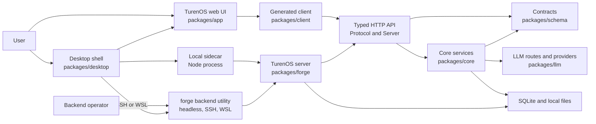
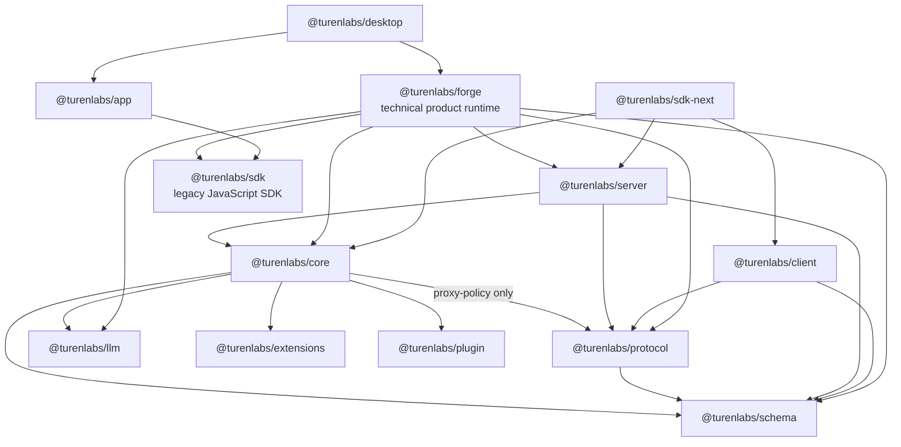

# TurenOS architecture

TurenOS runs a shared server from the Desktop sidecar, a headless CLI, or a remote host. The package
layers, process boundaries, data flow, Location scopes, and generated artifacts below describe the
implementation in this repository.

Names in code blocks and inline code are compatibility identifiers. In particular, `forge`,
`@turenlabs/forge`, `packages/forge`, `FORGE_*`, `.forge`, and `forge.json` are retained exactly;
see [Branding](./branding.md) for the complete policy.

## System shape

TurenOS is the user-facing web UI and Desktop application. `forge` is the supporting backend CLI
utility, used for headless servers, remote hosts, and backend administration rather than a separate
user-facing product. Both use one shared server implementation:

- The desktop shell hosts the web renderer and starts a supervised local server directly in an
  Electron utility process. It does not launch `forge serve` for its local backend or require a
  separately installed CLI.
- For SSH and managed WSL backends, Desktop starts the native executable with `forge serve`.
  The SSH path manages the remote server and connects through a tunnel; see
  [SSH remote servers](../operations/ssh-remote/README.md). Operators can also use `forge serve` for a separately
  managed headless server.
- The local sidecar and headless server compose the `packages/forge` server with the services in
  `@turenlabs/core`; they are not separate session engines.

The executable currently retains broader commands such as agent runs, providers, sessions, and
upgrades. Those commands are real supported entrypoints in the current implementation, but are not
the intended primary user experience. This role clarification does not remove them or rename any
compatibility identifiers.

Source: [local process startup](../../packages/desktop/src/main/server.ts),
[direct server loading](../../packages/desktop/src/main/sidecar.ts),
[SSH server startup](../../packages/desktop/src/main/ssh/shim.ts),
[WSL server startup](../../packages/desktop/src/main/wsl/sidecar.ts), and
[current CLI registration](../../packages/forge/src/index.ts).

The browser renderer does not call Core services directly. It uses a generated SDK client contract over
HTTP, server-sent events (SSE), and selected WebSocket routes.

The arrows in the package graph below mean "has a runtime dependency on". The package manifests
and the runtime boundary are intentionally separate from source naming compatibility.

### Package responsibilities

| Package                 | Responsibility                                                                                                                              | Source of truth                                                                          |
| ----------------------- | ------------------------------------------------------------------------------------------------------------------------------------------- | ---------------------------------------------------------------------------------------- |
| `@turenlabs/schema`     | Effect schemas and stable data contracts for sessions, events, locations, permissions, extensions, tools, and API payloads.                 | [`packages/schema/src/index.ts`](../../packages/schema/src/index.ts)                     |
| `@turenlabs/protocol`   | Typed HTTP API groups, middleware slots, errors, and transport schemas. It does not choose concrete Core services.                          | [`packages/protocol/src/api.ts`](../../packages/protocol/src/api.ts)                     |
| `@turenlabs/core`       | Shared Effect services, SQLite persistence, durable events, session V2 execution, permissions, memory, tools, and scoped service graphs.    | [`packages/core/src/location-services.ts`](../../packages/core/src/location-services.ts) |
| `@turenlabs/server`     | Standard server handlers and route composition for the typed API. It binds Protocol middleware to concrete Core location services.          | [`packages/server/src/routes.ts`](../../packages/server/src/routes.ts)                   |
| `@turenlabs/client`     | Client-side API contract and generated Promise and Effect clients. It is the transport boundary for consumers that use this API generation. | [`packages/client/src/contract.ts`](../../packages/client/src/contract.ts)               |
| `@turenlabs/sdk`        | Legacy JavaScript SDK, including its generated V2 client and types used by the current renderer.                                            | [`packages/sdk/js/package.json`](../../packages/sdk/js/package.json)                     |
| `@turenlabs/llm`        | Provider-neutral messages, streaming events, route transports, provider adapters, and provider protocol implementations.                    | [`packages/llm/src/llm.ts`](../../packages/llm/src/llm.ts)                               |
| `@turenlabs/extensions` | Validated catalog manifests and generated catalog data for tools, MCP, data, and skills.                                                    | [`packages/extensions/src/validate.ts`](../../packages/extensions/src/validate.ts)       |
| `@turenlabs/plugin`     | Plugin authoring API and V2 Effect and Promise registration surfaces.                                                                       | [`packages/plugin/src/index.ts`](../../packages/plugin/src/index.ts)                     |
| `@turenlabs/forge`      | Product composition layer containing the CLI, server, legacy runtime, V2 bridges, security integrations, MCP, and desktop-facing APIs.      | [`packages/forge/src/index.ts`](../../packages/forge/src/index.ts)                       |
| `@turenlabs/app`        | Solid renderer and user-facing application pages. It consumes the generated SDK client and UI packages.                                     | [`packages/app/package.json`](../../packages/app/package.json)                           |
| `@turenlabs/desktop`    | Electron main process, preload boundary, sidecar supervisor, window security, updater, and packaged analysis assets.                        | [`packages/desktop/src/main/index.ts`](../../packages/desktop/src/main/index.ts)         |
| `@turenlabs/sdk-next`   | Composition SDK that combines Client, Core, and Server for integrations that need all three.                                                | [`packages/sdk-next/package.json`](../../packages/sdk-next/package.json)                 |

## Runtime flow

[Runtime flow](./runtime-flow.md) follows a request from the Desktop through the sidecar server into Session execution,
and Session events back out to clients.

## Location and service scopes

[Location and service scopes](./locations.md) covers the global and Location-scoped service graphs and how a Location
identifies a directory, project, and workspace.

## Persistence and local data

[Persistence and local data](./persistence.md) covers the authoritative SQLite database, its connection model, and
where local data lives.

## Trust and scope boundaries

Untrusted input crosses [trust and scope boundaries](./trust-boundaries.md) at contracts and authentication, Location
and Session authority, tools, extensions and MCP, and event persistence.

## Generated and packaged artifacts

Generated files are outputs, not independent sources. Update the defining contract or manifest and
then run its generator; do not hand-edit generated output.

| Artifact                                                     | Source                                                                                                            | Generation or check                                                                                                                                             |
| ------------------------------------------------------------ | ----------------------------------------------------------------------------------------------------------------- | --------------------------------------------------------------------------------------------------------------------------------------------------------------- |
| `packages/client/src/generated/`                             | Protocol API plus [`packages/client/src/contract.ts`](../../packages/client/src/contract.ts) and API naming maps. | Run `bun run generate` from `packages/client`; [`packages/client/script/build.ts`](../../packages/client/script/build.ts) emits Promise and Effect clients.     |
| `packages/client/src/generated-effect/`                      | Same Client API contract and `@turenlabs/httpapi-codegen`.                                                        | Generated together with the Promise client; `check:generated` detects drift.                                                                                    |
| `packages/sdk/js/src/gen/` and `packages/sdk/js/src/v2/gen/` | Product OpenAPI and SDK source definitions.                                                                       | Regenerate the legacy JavaScript SDK with `./packages/sdk/js/script/build.ts`; keep its `forge` names because they are public SDK identifiers.                  |
| `packages/extensions/src/generated.ts`                       | JSON manifests in [`services/catalog/manifests/`](../../services/catalog/manifests/).                             | Run the extensions generator; [`packages/extensions/script/generate.ts`](../../packages/extensions/script/generate.ts) also validates catalog policy.           |
| `packages/core/src/database/schema.gen.ts`                   | Drizzle schema and migration sources in `packages/core/src/database/`.                                            | Database migration tooling owns the generated schema and migration journal. Do not edit the generated file directly.                                            |
| `packages/core/src/database/migration.gen.ts`                | Migration files in the Core database migration source tree.                                                       | Regenerate through the Core migration tooling when migrations change.                                                                                           |
| Desktop WASM bundles and verification metadata               | WASM package `SOURCE.json` files and package sources.                                                             | Desktop build verification scripts validate the packaged decompiler, YARA, and analysis artifacts.                                                              |
| `/doc` OpenAPI response                                      | Product `PublicApi` and route schemas.                                                                            | Built lazily from [`packages/forge/src/server/server.ts`](../../packages/forge/src/server/server.ts); it is a runtime artifact, not a checked-in client source. |

The generated Client index intentionally exports compatibility names such as `ForgeEvent`. Those
names are API identifiers, not display text. See [`packages/client/src/index.ts`](../../packages/client/src/index.ts)
and [Branding](./branding.md).

## Operational constraints

| Area              | Current constraint and consequence                                                                                                                                                                             | Source                                                                                                                                                                                                     |
| ----------------- | -------------------------------------------------------------------------------------------------------------------------------------------------------------------------------------------------------------- | ---------------------------------------------------------------------------------------------------------------------------------------------------------------------------------------------------------- |
| Database          | One primary writer and four readers (`FORGE_DB_READERS`, at most eight). WAL, `synchronous=FULL`, `secure_delete=ON`, foreign keys, query-only readers, and a five-second busy timeout are configured by Core. | [`packages/core/src/database/database.ts`](../../packages/core/src/database/database.ts)                                                                                                                   |
| Database identity | `FORGE_DB` and channel database names are compatibility behavior. Database files are protected with mode `0600` where supported.                                                                               | [`packages/core/src/database/database.ts`](../../packages/core/src/database/database.ts)                                                                                                                   |
| Secret storage    | Persistent server startup requires an OS-protected vault key outside tests. There is no plaintext fallback for persistent secrets.                                                                             | [`packages/core/src/secret-vault.ts`](../../packages/core/src/secret-vault.ts), [`secure-storage.md`](../systems/secure-storage.md)                                                                        |
| Session execution | A Session has one local drain at a time. Same-Session resumes join it; different Sessions may run concurrently. Durable wakeups are advisory and crash continuation is not an implicit provider retry.         | [`packages/core/src/session/run-coordinator.ts`](../../packages/core/src/session/run-coordinator.ts), [`packages/core/src/session/execution/local.ts`](../../packages/core/src/session/execution/local.ts) |
| Provider turns    | One explicit `llm.stream(request)` call represents one provider turn. History is reloaded before durable continuation.                                                                                         | [`packages/core/src/session/runner/llm.ts`](../../packages/core/src/session/runner/llm.ts)                                                                                                                 |
| Local tools       | A provider message may settle at most eight local tool calls concurrently. This controls fan-out but does not resolve write-write conflicts between tools.                                                     | [`packages/core/src/session/runner/llm.ts`](../../packages/core/src/session/runner/llm.ts)                                                                                                                 |
| Tool output       | Default V2 output limits are 2,000 lines and 50 KiB; oversized output is written under `tool-output` and shown as a bounded preview.                                                                           | [`packages/core/src/tool-output-store.ts`](../../packages/core/src/tool-output-store.ts)                                                                                                                   |
| Retention         | Event authority stays byte-exact. Derived message and tool settlement copies may be previewed by a globally scheduled, bounded retention sweep.                                                                | [`packages/core/src/retention.ts`](../../packages/core/src/retention.ts)                                                                                                                                   |
| MCP selection     | A Session may load at most 12 MCP tools globally. Each integration's manifest sets its own limit (default 4); selections idle for 3 turns are unloaded.                                                        | [`packages/forge/src/mcp/broker.ts`](../../packages/forge/src/mcp/broker.ts)                                                                                                                               |
| MCP runtime       | Selectable backends are Docker and local process. Managed package recipes use pinned versions and a managed `uv` executable; secrets are supplied to isolated child environments.                              | [`packages/forge/src/mcp/runtime.ts`](../../packages/forge/src/mcp/runtime.ts), [`packages/forge/src/mcp/package-runtime.ts`](../../packages/forge/src/mcp/package-runtime.ts)                             |
| HTTP streams      | SSE endpoints use `no-store`, heartbeats, and location-aware filtering. A stalled subscriber remains an operational risk and must be monitored with bounded transport work.                                    | [`packages/forge/src/server/routes/instance/httpapi/handlers/event.ts`](../../packages/forge/src/server/routes/instance/httpapi/handlers/event.ts)                                                         |
| Desktop lifecycle | The sidecar exits when its Electron parent disappears and gets a bounded orphan-stop window. The desktop owns teardown and does not leave a server process behind on normal parent death.                      | [`packages/desktop/src/main/sidecar.ts`](../../packages/desktop/src/main/sidecar.ts)                                                                                                                       |
| Generated code    | Public API changes require regeneration from `packages/client`; generated directories are never edited directly.                                                                                               | [`packages/client/script/build.ts`](../../packages/client/script/build.ts)                                                                                                                                 |

## Source map

Use these entry points when tracing a behavior:

- Product composition and CLI: [`packages/forge/src/index.ts`](../../packages/forge/src/index.ts).
- Product server and route layers: [`packages/forge/src/server/server.ts`](../../packages/forge/src/server/server.ts).
- Standard typed API: [`packages/protocol/src/api.ts`](../../packages/protocol/src/api.ts) and [`packages/server/src/routes.ts`](../../packages/server/src/routes.ts).
- Core service graph: [`packages/core/src/location-services.ts`](../../packages/core/src/location-services.ts).
- Database and migrations: [`packages/core/src/database/database.ts`](../../packages/core/src/database/database.ts) and [`packages/core/src/database/migration.ts`](../../packages/core/src/database/migration.ts).
- Event authority: [`packages/core/src/event.ts`](../../packages/core/src/event.ts).
- Session V2 public service: [`packages/core/src/session.ts`](../../packages/core/src/session.ts).
- Session runner: [`packages/core/src/session/runner/llm.ts`](../../packages/core/src/session/runner/llm.ts).
- Desktop parent and sidecar: [`packages/desktop/src/main/index.ts`](../../packages/desktop/src/main/index.ts) and [`packages/desktop/src/main/sidecar.ts`](../../packages/desktop/src/main/sidecar.ts).
- Naming and retained identifiers: [`branding.md`](./branding.md).
