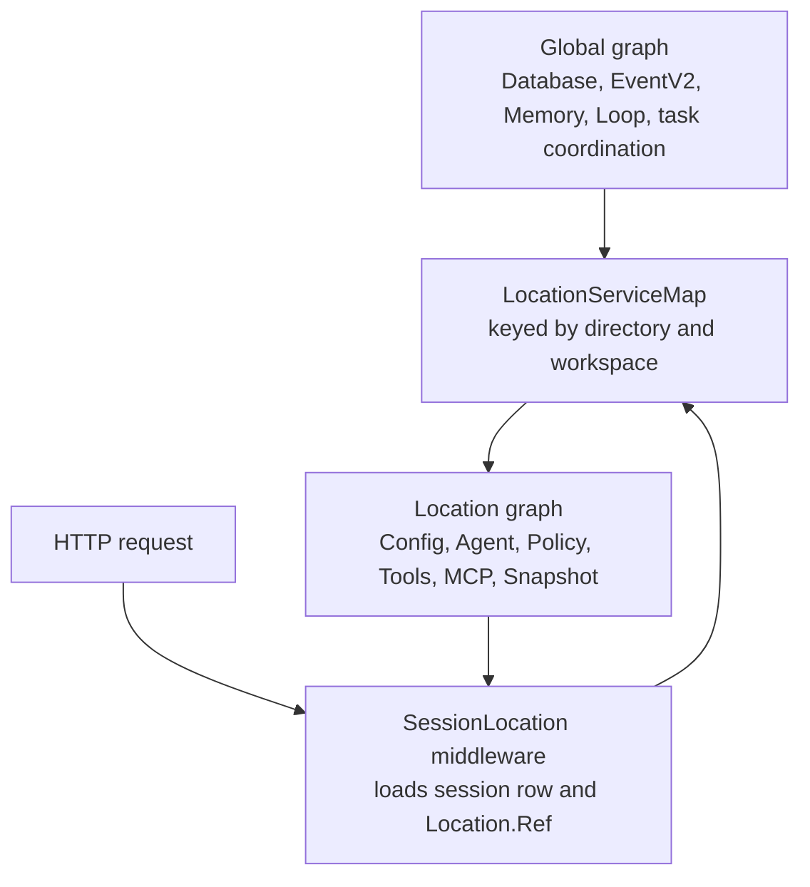

# Location and service scopes

TurenOS has a global service graph and a Location-scoped service graph. A Location identifies an
opened directory, its resolved project, and an optional workspace identity. Omitted
`Location.workspaceID` means implicit-local placement. Explicit workspace identity is carried through
routing but remains reserved for future placement semantics.

`LayerNode` encodes the graph and checks dependency and scope tags while the graph is built.
`buildLocationServiceMap` hoists global nodes and constructs one fresh Location layer per reference,
with an idle lifetime for cached entries. The map is the seam where a future remote placement
implementation can replace local Location services without changing API contracts.

- [`packages/core/src/effect/layer-node.ts`](../../packages/core/src/effect/layer-node.ts) defines
  dependency checking, tags, hoisting, replacement, and compilation.
- [`packages/core/src/effect/app-node.ts`](../../packages/core/src/effect/app-node.ts) defines the
  `global` and `location` tags.
- [`packages/core/src/location-services.ts`](../../packages/core/src/location-services.ts) lists the
  Location graph and its global dependencies.
- [`packages/server/src/location.ts`](../../packages/server/src/location.ts) resolves a request's
  directory/workspace reference.
- [`packages/server/src/middleware/session-location.ts`](../../packages/server/src/middleware/session-location.ts)
  resolves a Session row before providing its Location graph.
- [`packages/forge/src/project/instance-store.ts`](../../packages/forge/src/project/instance-store.ts)
  owns legacy per-directory instance loading and disposal.

Project identity is durable and is not re-derived from a mutable remote URL after it has been
claimed. Git discovery can seed an identity for a new directory; a remembered identity wins on later
opens. See [`packages/core/src/project.ts`](../../packages/core/src/project.ts) and the multi-project contract in
[`specs/project.md`](../../specs/project.md).
