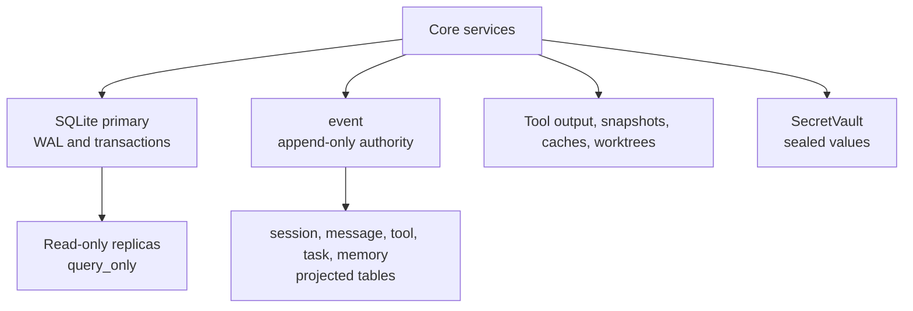

# Persistence and local data

SQLite is the authoritative local database for ordered events, projections, identities, sessions,
permissions, tasks, memory, and operational metadata. Core opens one primary connection and a
bounded reader pool. The primary uses WAL mode and full synchronous writes; readers are query-only.
Database files, WAL files, and shared-memory files receive owner-only permissions where supported.

Core's path selection keeps channel-specific database names for compatibility. `Flag.FORGE_DB`
can select an in-memory or absolute path; packaged channels use `forge.db`, while other channels
use a sanitized channel suffix. See [`packages/core/src/database/database.ts`](../../packages/core/src/database/database.ts)
and [`packages/core/src/global.ts`](../../packages/core/src/global.ts). Do not infer a new path from the
TurenOS display name.

Large or bounded tool results have a second storage path. `ToolOutputStore` keeps normal output
inline, and writes oversized text under the data directory when it exceeds the configured line or
byte limits. The model receives a head/tail preview and a path to the full output. This is a bound,
not a sandbox: the shell tool still has host-user authority, as documented in
[`dangerous-commands.md`](../systems/dangerous-commands/README.md).

Credentials and other small sensitive values use `SecretVault`, which derives a scope-bound key and
seals an authenticated AES-256-GCM envelope. The `forge-secret:v1` format and the vault environment
names are compatibility identifiers and must not be renamed. See [`secure-storage.md`](../systems/secure-storage.md)
and [`packages/core/src/secret-vault.ts`](../../packages/core/src/secret-vault.ts).

Retention rewrites derived message and tool settlement copies but does not rewrite the append-only
event authority. Sweeps are bounded and scheduled globally because all Locations share the database.
See [`packages/core/src/retention.ts`](../../packages/core/src/retention.ts).
