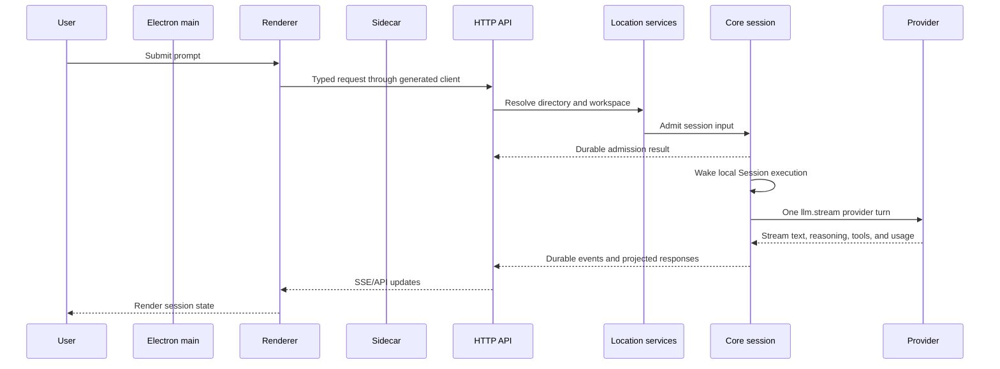
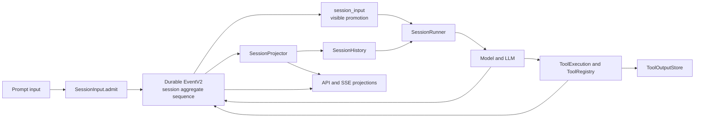

# Runtime flow

How a request travels from the Desktop through the sidecar server into Session execution, and how Session events
flow back out to clients.

## Process and request flow

The desktop process owns the window and launches the sidecar. The sidecar imports the server only
when it receives a start command, listens on the selected host and port, and reports readiness back
to Electron. The parent-watch path stops an orphaned sidecar rather than leaving a server behind.

The same Core services can be reached by the CLI and by the server without Electron. The desktop
sidecar is therefore a supervisor and transport host, not a second session engine.

The server has two API families:

- `@turenlabs/protocol` defines the standard `server.*` groups used by the generated Client API
  (`HttpApi.make("server")` in `packages/protocol/src/api.ts`), and `@turenlabs/server` implements them.
- `packages/forge` adds the product's root, instance, event, PTY, sync, security, and
  compatibility routes and supplies concrete handlers.

[`packages/forge/src/server/routes/instance/httpapi/server.ts`](../../packages/forge/src/server/routes/instance/httpapi/server.ts)
shows the complete product route tree. [`packages/server/src/routes.ts`](../../packages/server/src/routes.ts)
shows the smaller standard route composition.

## Session and event data flow

Session V2 separates durable admission from model execution. The normative contract is
[`specs/v2/session.md`](../../specs/v2/session.md); this section summarizes it:

1. A prompt, command, or goal input is validated and admitted as one `session_input` record through a
   durable `session.next.prompt.admitted` event.
2. The local process schedules `SessionExecution.wake(sessionID)`. The wake is advisory and does
   not itself retry provider work after a crash.
3. The serialized local coordinator joins same-Session resumes, coalesces wakeups, and permits
   different Sessions to run concurrently.
4. The runner reloads projected history at each continuation boundary, resolves the model and tools
   from the Location graph, and performs exactly one `llm.stream(request)` call for a provider turn.
5. Stream events are persisted as durable Session events. Projectors update the visible session,
   messages, parts, usage, and status rows.
6. Local tool calls are durably claimed before execution, pass the permission and interceptor
   boundary, and settle through the Tool Registry. After all calls settle, the runner reloads
   history and decides whether to continue.
7. Admitted inputs become visible user messages at the next safe provider-turn boundary, so user
   input can join an active drain without waiting for idle. Delivery decides how
   (`packages/core/src/session/input.ts`):
   - **Steer** (the default for prompts): every pending steer is promoted at the boundary, and steers
     always go before queued inputs.
   - **Queue**: one queued user input is promoted per boundary, after in-flight tool calls settle, and
     continuation is re-evaluated before the next.
   - **Machine advisories** (board posts, settle notices, child advisories, shell-job completions):
     queued like user input, but a consecutive run of them (up to 32, `MAX_QUEUE_PROMOTE_BATCH`) is
     promoted as one batch, stopping at the next user input, so a settling swarm costs one provider turn.

The append-only EventV2 log is the replay authority. Durable events have an aggregate ID, a
monotonic aggregate sequence, and a versioned type. Projectors run in the same transaction as the
event commit. Replays must match the stored ID, type, sequence, and encoded data exactly; divergent
replay is a failure, not a merge.

- Event definitions and commit/replay behavior: [`packages/core/src/event.ts`](../../packages/core/src/event.ts)
  and [`packages/schema/src/event.ts`](../../packages/schema/src/event.ts).
- Session event types and durable versions: [`packages/core/src/session/event.ts`](../../packages/core/src/session/event.ts)
  and [`packages/schema/src/session-event.ts`](../../packages/schema/src/session-event.ts).
- Admission, identity reconciliation, cancellation, and promotion: [`packages/core/src/session/input.ts`](../../packages/core/src/session/input.ts).
- History selection and compaction checkpoints: [`packages/core/src/session/history.ts`](../../packages/core/src/session/history.ts).
- Projected messages and usage: [`packages/core/src/session/projector.ts`](../../packages/core/src/session/projector.ts).
- Local process execution and placement lookup: [`packages/core/src/session/execution/local.ts`](../../packages/core/src/session/execution/local.ts).
- Provider-turn orchestration: [`packages/core/src/session/runner/llm.ts`](../../packages/core/src/session/runner/llm.ts).

The legacy `packages/forge` session processor and prompt runtime remain compatibility paths. V2
execution is not bridged through the legacy prompt loop; the explicit cutover boundary is
[`packages/forge/src/session/v2-cutover.ts`](../../packages/forge/src/session/v2-cutover.ts).
