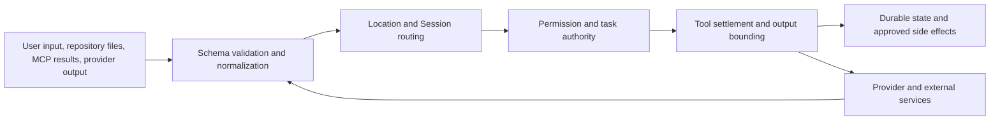

# Trust and scope boundaries

Untrusted input (user prompts, repository files, MCP results, provider output) passes a fixed sequence of boundaries
before it can change durable state or cause a side effect. None of them makes TurenOS a sandbox: shell commands still
run with the host user's authority.

## Contract and authentication boundary

Protocol owns API shape, errors, and middleware positions. Server and product routes provide the
concrete middleware and handlers. The HTTP server applies authorization before protected handlers;
credential checks accept a Basic Auth header or the same base64 credentials in an `auth_token` query
parameter, in both servers, and the query parameter wins when both are present. The query form puts the password in
request URLs, where proxies and logs may record it.
Ticketed PTY WebSocket connects skip the normal browser credential check only because the PTY handler
consumes and validates the ticket. Both servers skip it: the legacy server's `ptyConnectAuthorizationLayer` and the
Session V2 server's `authorizationLayer`.
See [`packages/protocol/src/middleware/authorization.ts`](../../packages/protocol/src/middleware/authorization.ts),
[`packages/server/src/middleware/authorization.ts`](../../packages/server/src/middleware/authorization.ts),
[`packages/forge/src/server/routes/instance/httpapi/middleware/authorization.ts`](../../packages/forge/src/server/routes/instance/httpapi/middleware/authorization.ts),
and [`packages/forge/src/server/shared/pty-ticket.ts`](../../packages/forge/src/server/shared/pty-ticket.ts).

The desktop renderer is not granted arbitrary navigation or IPC authority. The main process owns
window creation, validates renderer origins, routes trusted IPC, and opens validated HTTP(S)
destinations externally. See [`packages/desktop/src/main/window-security.ts`](../../packages/desktop/src/main/window-security.ts),
[`packages/desktop/src/main/trusted-ipc.ts`](../../packages/desktop/src/main/trusted-ipc.ts), and
[`packages/desktop/src/main/windows.ts`](../../packages/desktop/src/main/windows.ts).

## Location, Session, and task authority

A request is not authorized solely by a directory string. Location middleware resolves the project
and optional workspace; Session middleware reads the Session row and provides the Session's recorded
Location. Session tasks carry parent/child authority, write roots, exact commands, permissions,
and ownership. Mutations are rejected when task ownership or the durable authority chain conflicts.
The task graph is depth-limited: `MAX_DEPTH` is 1, so a child task cannot spawn its own children
([`packages/core/src/session/task.ts`](../../packages/core/src/session/task.ts)).

## Tool authority

The Tool Registry materializes only tools available for the current provider turn. Permission
rules are evaluated at execution time, after the current task authority is known. Tool calls are
recorded before side effects, then intercepted, executed, bounded, and durably settled. The V2
registry and execution ledger are in [`packages/core/src/tool/registry.ts`](../../packages/core/src/tool/registry.ts)
and [`packages/core/src/tool/execution.ts`](../../packages/core/src/tool/execution.ts). The legacy
registry remains in [`packages/forge/src/tool/registry.ts`](../../packages/forge/src/tool/registry.ts).

TurenOS is not a general-purpose sandbox. In particular, `bash` runs with the host user's
filesystem, process, and network authority. The recursive-delete guard narrows one dangerous class
of shell commands; it does not turn shell execution into isolation. See
[Dangerous commands](../systems/dangerous-commands/README.md).

## Extension and MCP trust

Extension manifests are schema-validated and policy-checked. Official manifests are restricted to
the `turenlabs/` namespace. Community manifests cannot select privileged local adapters or inject
adapter-managed credentials; data contributions are read-only. Repository plugin files have a
fingerprint and an explicit trust decision before activation. See
[`packages/extensions/src/validate.ts`](../../packages/extensions/src/validate.ts),
[`packages/core/src/extension.ts`](../../packages/core/src/extension.ts), and
[`packages/core/src/plugin/trust.ts`](../../packages/core/src/plugin/trust.ts).

MCP is an integration boundary, not a second tool authority. TurenOS selects declared capabilities,
limits loaded tools per Session, sanitizes community definitions, isolates managed environments, and
passes external content back through the normal tool settlement path. Managed package recipes pin
package versions and environment policy; manifests do not gain arbitrary process authority. See
[`packages/forge/src/mcp/index.ts`](../../packages/forge/src/mcp/index.ts),
[`packages/forge/src/mcp/integration.ts`](../../packages/forge/src/mcp/integration.ts), and
[`packages/forge/src/mcp/package-runtime.ts`](../../packages/forge/src/mcp/package-runtime.ts).

## Event and sync boundary

`EventV2Bridge` attaches a Location to direct product events and publishes them to the local event
bus. It emits sync envelopes only for eligible durable aggregates; Session task aggregates and other
protected ownership records are excluded. A peer must replay the exact encoded event rather than
mutating a projection directly. See [`packages/forge/src/event-v2-bridge.ts`](../../packages/forge/src/event-v2-bridge.ts)
and [`packages/forge/src/control-plane/workspace.ts`](../../packages/forge/src/control-plane/workspace.ts).

## Outbound network calls

Besides model provider requests, MCP servers, and commands the agent runs, TurenOS opens these
connections itself. Downloads land under the TurenOS data or cache directories.

| Connection                     | When                                                                                                                                                                                                                                                                                                                          | Source                                                                                                                                                                                                 | Turn off                                                                                                                                                                                                                                                                                              |
| ------------------------------ | ----------------------------------------------------------------------------------------------------------------------------------------------------------------------------------------------------------------------------------------------------------------------------------------------------------------------------- | ------------------------------------------------------------------------------------------------------------------------------------------------------------------------------------------------------ | ----------------------------------------------------------------------------------------------------------------------------------------------------------------------------------------------------------------------------------------------------------------------------------------------------- |
| Sentry error reports           | Release Desktop builds are built with `VITE_SENTRY_DSN` (`.github/workflows/release.yml`). In the `prod` channel the global error handlers are dropped, so reports come from the renderer's explicit `Sentry.captureException` calls. Builds without the variable send nothing.                                               | `packages/desktop/src/renderer/index.tsx`, `packages/app/src/entry.tsx`, `packages/app/src/app.tsx`                                                                                                    | No runtime switch; build without `VITE_SENTRY_DSN`.                                                                                                                                                                                                                                                   |
| models.dev catalog             | Fetched from `https://models.dev` at server start unless the cached copy is under five minutes old, then every 60 minutes. The cache is written to the cache directory.                                                                                                                                                       | `packages/core/src/models-dev.ts`                                                                                                                                                                      | `FORGE_DISABLE_MODELS_FETCH` stops the startup and hourly fetches, but `forge models --refresh` and `forge auth login` still force one. `FORGE_MODELS_URL` points at another source. `FORGE_MODELS_PATH` reads a local file instead of the cache but does not stop the fetch; offline use needs both. |
| Web search                     | The `websearch` tool calls Exa (`https://mcp.exa.ai/mcp`, without a key when `EXA_API_KEY` is unset) or Parallel (`https://search.parallel.ai/mcp`). Both catalog entries are enabled by default; with both on, the Session ID picks one.                                                                                     | `packages/core/src/tool/websearch.ts`, `packages/forge/src/tool/websearch.ts`                                                                                                                          | Disable the Exa Web Search and Parallel Web Search extensions.                                                                                                                                                                                                                                        |
| ripgrep binary                 | When no `rg` is on `PATH` or in the TurenOS `bin` directory, the pinned release is downloaded from `github.com/BurntSushi/ripgrep`. The archive is not checksum-verified.                                                                                                                                                     | `packages/core/src/ripgrep/binary.ts`                                                                                                                                                                  | Install `rg` on `PATH`.                                                                                                                                                                                                                                                                               |
| Language servers               | When a language server is first needed and not installed, TurenOS downloads or installs it: GitHub releases and the GitHub API, eclipse.org, the JetBrains CDN, HashiCorp releases, or a package manager.                                                                                                                     | `packages/forge/src/lsp/server.ts`                                                                                                                                                                     | `FORGE_DISABLE_LSP_DOWNLOAD` (`packages/forge/src/effect/runtime-flags.ts`), except for the TypeScript and Biome servers, which install from npm through `Npm.which` without checking it.                                                                                                             |
| Ollama and llama.cpp discovery | Every 10 seconds the provider plugins probe `127.0.0.1:11434` and `127.0.0.1:8080`. Endpoints come from provider config, `OLLAMA_HOST`, or `LLAMA_CPP_HOST`, and only loopback addresses are accepted.                                                                                                                        | `packages/core/src/plugin/provider/ollama.ts`, `packages/core/src/plugin/provider/llama-cpp.ts`                                                                                                        | No switch; the probes never leave the machine.                                                                                                                                                                                                                                                        |
| Desktop updater                | `prod` channel only: at launch and every 10 minutes, `electron-updater` checks `github.com/turenlabs/turenos` releases. A non-zero update lag first lists releases from `api.github.com`.                                                                                                                                     | `packages/desktop/src/main/updater.ts`, `packages/desktop/src/main/index.ts`, `packages/desktop/src/main/constants.ts`                                                                                 | No user switch; other channels do not check.                                                                                                                                                                                                                                                          |
| Threat intelligence feeds      | Checked at server start and every six hours; a poll runs when the snapshot is older than six hours. See [Threat intelligence feeds](../systems/intel-feeds.md).                                                                                                                                                               | `packages/server/src/intel/sources.ts`                                                                                                                                                                 | Disable every feed under Settings > Infrastructure > Threat intelligence; there is no global switch.                                                                                                                                                                                                  |
| Batou scanner                  | On first enable, downloads the pinned release from GitHub and checks its SHA-256. See [Batou](../systems/batou.md).                                                                                                                                                                                                           | `packages/forge/src/security/batou-binary.ts`                                                                                                                                                          | Leave Batou disabled.                                                                                                                                                                                                                                                                                 |
| `uv` for MCP recipes           | When a managed package recipe first needs it, the pinned `uv` release is downloaded from `releases.astral.sh` and checked against a SHA-256.                                                                                                                                                                                  | `packages/forge/src/mcp/uv-runtime.ts`                                                                                                                                                                 | Use no `uv`-based recipes.                                                                                                                                                                                                                                                                            |
| Code-search embedding model    | The first `code_search` query in a Location downloads the pinned `minishlab/potion-base-8M` model and tokenizer from `huggingface.co` into the cache directory and checks their SHA-256; a Location stops retrying after three failed loads. Semantic memory downloads the same model when `semantic_memory.enabled` is true. | `packages/core/src/search/index.ts`, `packages/core/src/memory/semantic.ts`, `packages/plugin/src/potion.ts`                                                                                           | None for code search; `semantic_memory` affects only semantic memory, which is off unless enabled.                                                                                                                                                                                                    |
| npm packages                   | Installed with Arborist from the configured npm registry into `<cache>/packages/`, with install scripts off: provider SDK packages named by a model's `npm` field, npm plugins from config, and the Prettier, oxfmt, and Biome formatters when the project uses them.                                                         | `packages/core/src/npm.ts`, `packages/core/src/plugin/provider/dynamic.ts`, `packages/forge/src/provider/provider.ts`, `packages/forge/src/plugin/shared.ts`, `packages/forge/src/format/formatter.ts` | Providers: none (a `file://` package path skips the install). Plugins: `FORGE_PURE` (legacy). Formatters: leave `formatter` unset.                                                                                                                                                                    |

The Vigil skill scanner downloads nothing: its binary, model, and ONNX Runtime ship inside the release
(see [Developer catalog runtime](../systems/developer-catalog-runtime/README.md)).
