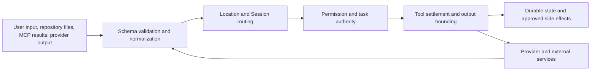

# Trust and scope boundaries

The following boundaries are deliberate:

## Contract and authentication boundary

Protocol owns API shape, errors, and middleware positions. Server and product routes provide the
concrete middleware and handlers. The HTTP server applies authorization before protected handlers;
credential checks use Basic Auth or the compatibility `auth_token` query path where configured.
Ticketed PTY WebSocket connects skip the normal browser credential check only because the PTY handler
consumes and validates the ticket. See [`packages/protocol/src/middleware/authorization.ts`](../../packages/protocol/src/middleware/authorization.ts),
[`packages/server/src/middleware/authorization.ts`](../../packages/server/src/middleware/authorization.ts),
and [`packages/forge/src/server/shared/pty-ticket.ts`](../../packages/forge/src/server/shared/pty-ticket.ts).

The desktop renderer is not granted arbitrary navigation or IPC authority. The main process owns
window creation, validates renderer origins, routes trusted IPC, and opens validated HTTP(S)
destinations externally. See [`packages/desktop/src/main/window-security.ts`](../../packages/desktop/src/main/window-security.ts),
[`packages/desktop/src/main/trusted-ipc.ts`](../../packages/desktop/src/main/trusted-ipc.ts), and
[`packages/desktop/src/main/windows.ts`](../../packages/desktop/src/main/windows.ts).

## Location, Session, and task authority

A request is not authorized solely by a directory string. Location middleware resolves the project
and optional workspace; Session middleware reads the Session row and provides the Session's recorded
Location. Session tasks carry parent/child authority, write roots, exact commands, permissions,
and ownership. Mutations are rejected when task ownership or the durable authority chain conflicts.
The task graph is deliberately depth-limited; `MAX_DEPTH` is defined in
[`packages/core/src/session/task.ts`](../../packages/core/src/session/task.ts).

## Tool authority

The Tool Registry materializes only tools available for the current provider turn. Permission
rules are evaluated at execution time, after the current task authority is known. Tool calls are
recorded before side effects, then intercepted, executed, bounded, and durably settled. The V2
registry and execution ledger are in [`packages/core/src/tool/registry.ts`](../../packages/core/src/tool/registry.ts)
and [`packages/core/src/tool/execution.ts`](../../packages/core/src/tool/execution.ts). The legacy
registry remains in [`packages/forge/src/tool/registry.ts`](../../packages/forge/src/tool/registry.ts).

TurenOS is not a general-purpose sandbox. In particular, `bash` runs with the host user's
filesystem, process, and network authority. The recursive-delete guard narrows one dangerous class
of shell commands; it does not turn shell execution into isolation. See
[`dangerous-commands.md`](../systems/dangerous-commands/README.md).

## Extension and MCP trust

Extension manifests are schema-validated and policy-checked. Official manifests are restricted to
the `turenlabs/` namespace. Community manifests cannot select privileged local adapters or inject
adapter-managed credentials; data contributions are read-only. Repository plugin files have a
fingerprint and an explicit trust decision before activation. See
[`packages/extensions/src/validate.ts`](../../packages/extensions/src/validate.ts),
[`packages/core/src/extension.ts`](../../packages/core/src/extension.ts), and
[`packages/core/src/plugin/trust.ts`](../../packages/core/src/plugin/trust.ts).

MCP is an integration boundary, not a second tool authority. TurenOS selects declared capabilities,
limits loaded tools per Session, sanitizes community definitions, isolates managed environments, and
passes external content back through the normal tool settlement path. Managed package recipes pin
package versions and environment policy; manifests do not gain arbitrary process authority. See
[`packages/forge/src/mcp/index.ts`](../../packages/forge/src/mcp/index.ts),
[`packages/forge/src/mcp/integration.ts`](../../packages/forge/src/mcp/integration.ts), and
[`packages/forge/src/mcp/package-runtime.ts`](../../packages/forge/src/mcp/package-runtime.ts).

## Event and sync boundary

`EventV2Bridge` attaches a Location to direct product events and publishes them to the local event
bus. It emits sync envelopes only for eligible durable aggregates; Session task aggregates and other
protected ownership records are excluded. A peer must replay the exact encoded event rather than
mutating a projection directly. See [`packages/forge/src/event-v2-bridge.ts`](../../packages/forge/src/event-v2-bridge.ts)
and [`packages/forge/src/control-plane/workspace.ts`](../../packages/forge/src/control-plane/workspace.ts).
