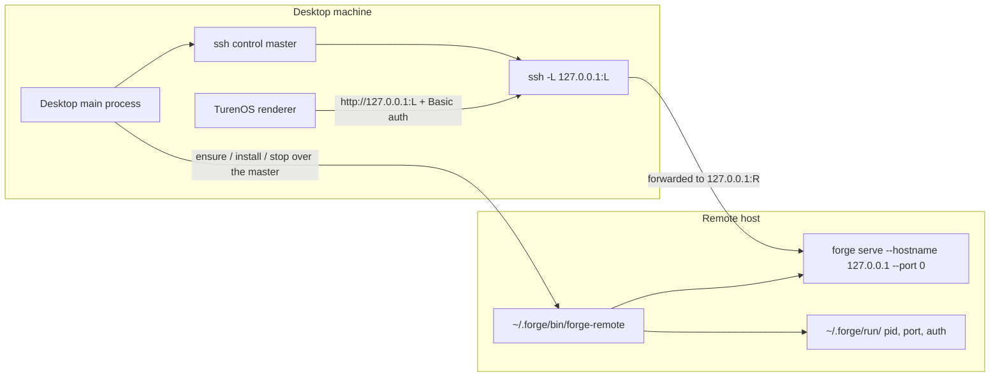

# SSH remote servers

TurenOS Desktop can run a full TurenOS backend on another machine and use it as if it were local.
The Desktop main process drives the system `ssh` client, installs and supervises `forge serve` on
the remote host, and forwards the remote listener to a loopback port on this machine. The renderer
then talks to that loopback URL through the ordinary generated HTTP/SSE client — nothing in the app
or server layers knows the connection is remote.

This is a Desktop-only feature that needs an `ssh` client on the desktop machine; the code carries
`win32` branches (`ssh.exe`, a `%TEMP%` control directory, hidden windows) alongside the POSIX path.
The remote needs an SSH server and a POSIX shell; the managed installer supports Linux and macOS
remote binaries. Native Windows remote startup is not implemented by this shim. The desktop starts
a Forge server on remote loopback without requiring an additional network-facing application port.

Implementation lives in [`packages/desktop/src/main/ssh`](../../../packages/desktop/src/main/ssh) with
the UI in [`packages/app/src/ssh`](../../../packages/app/src/ssh).

## Shape

The remote server binds loopback only. Its sole reachable path is the SSH forward, and every request
on that forward still carries HTTP Basic auth.

## Compared with adding a server by URL

Desktop can also reach a remote backend the plain way: run `forge serve` on a reachable port and add
it as an `http` server connection. The SSH path exists because that alternative pushes real work onto
the operator.

|                    | SSH remote                                                                                                                                      | Server added by URL                                                                                                                                                               |
| ------------------ | ----------------------------------------------------------------------------------------------------------------------------------------------- | --------------------------------------------------------------------------------------------------------------------------------------------------------------------------------- |
| Inbound exposure   | None. The remote binds `127.0.0.1` on a kernel-assigned port.                                                                                   | A listening port must be reachable from the desktop.                                                                                                                              |
| Transport security | Encrypted, with host-key identity, by construction.                                                                                             | `normalizeServerUrl` turns a bare `host:port` into `http://`, so Basic credentials and all session traffic cross the network in cleartext unless the operator fronts it with TLS. |
| Credentials        | Minted per start on the remote, kept memory-only on the desktop, re-read on every connect.                                                      | `username`/`password` are persisted with the connection in the renderer's `server.v3` store.                                                                                      |
| Authentication     | Reuses existing SSH keys, agent, 2FA, and `known_hosts`. No new secret to distribute.                                                           | A shared password the operator invents and distributes.                                                                                                                           |
| Setup              | Name a host you can already `ssh` into. forge is installed if missing and started for you; version mismatches are reported for explicit update. | Install forge on the host, pick a port, open it through the firewall, invent and distribute a password, and arrange TLS.                                                          |
| Lifecycle          | Installs, version-checks, daemonizes, health-checks, and auto-reconnects.                                                                       | Someone else runs, updates, and supervises the server.                                                                                                                            |
| Per-request cost   | One authenticated connection, multiplexed, `ControlPersist=10m` — auth is paid once.                                                            | HTTP clients may reuse connections; no SSH authentication or tunnel overhead.                                                                                                     |

The honest trade is throughput. Tunneling is not faster than talking to a port directly: traffic is
encrypted, crosses an extra process hop on both ends, and is subject to the SSH channel's own flow
control. What the tunnel buys is that no port is exposed, nothing needs a certificate, and the
credential that grants access is one the operator already manages. For a long-lived agent session —
mostly SSE and modest JSON — that trade is easy; for bulk file transfer it is not.

Adding a server by URL remains the right choice for a backend that is already operated behind TLS or
a reverse proxy, shared by several users, or running somewhere the user has no shell account.

## Components

| Piece                  | Responsibility                                                                                                                                                 | Source                                                                  |
| ---------------------- | -------------------------------------------------------------------------------------------------------------------------------------------------------------- | ----------------------------------------------------------------------- |
| `runtime.ts`           | All `ssh` process work: target parsing, `ssh -G` resolution, control master, pty prompt detection, remote command execution, remote file writes, tunnel spawn. | [`runtime.ts`](../../../packages/desktop/src/main/ssh/runtime.ts)       |
| `shim.ts`              | The POSIX `sh` lifecycle script written to the remote as `~/.forge/bin/forge-remote`, plus parsing of its state line.                                          | [`shim.ts`](../../../packages/desktop/src/main/ssh/shim.ts)             |
| `connection.ts`        | One full connect: master → refresh shim → `ensure` (installing forge if missing) → tunnel → health. Also graceful remote stop.                                 | [`connection.ts`](../../../packages/desktop/src/main/ssh/connection.ts) |
| `servers.ts`           | The controller: persisted server list, per-server runtime state, prompts, jobs, reconnect backoff, and the public API surface.                                 | [`servers.ts`](../../../packages/desktop/src/main/ssh/servers.ts)       |
| `policy.ts`            | Pure helpers: config construction from a resolved target, cached-state clearing, IPC input validation.                                                         | [`policy.ts`](../../../packages/desktop/src/main/ssh/policy.ts)         |
| `startup.ts`           | Pure policy: which servers auto-start, reconnect backoff schedule, health polling, post-install version assertion.                                             | [`startup.ts`](../../../packages/desktop/src/main/ssh/startup.ts)       |
| `ipc.ts`               | `ssh-servers-*` IPC handlers over `TrustedIpc`, including per-sender state subscriptions.                                                                      | [`ipc.ts`](../../../packages/desktop/src/main/ssh/ipc.ts)               |
| `packages/app/src/ssh` | Settings list, add-server dialog, global prompt host, and the state context fed by IPC events.                                                                 | [`app/src/ssh`](../../../packages/app/src/ssh)                          |

The controller is constructed and wired in
[`packages/desktop/src/main/index.ts`](../../../packages/desktop/src/main/index.ts): it gets the control
directory, the credential vault, the packaged `forge-cli` path, the app version, and the renderer
CORS origins, and it reads/writes its server list through product storage under the `ssh-servers`
key. `initialize()` runs at startup and connects every persisted server;
[`shutdown.ts`](../../../packages/desktop/src/main/shutdown.ts) calls `stopAll()` on quit.

## Connecting to the host

[Connecting to the host](./connection.md) covers host identity, authentication, connection multiplexing, and the
tunnel with its readiness checks.

## Installing and running on the remote

[Installing and running on the remote](./remote-install.md) covers the `forge-remote` shim, installing and updating
`forge` on the host, and runtime state and recovery.

## Surface

The controller's API is exposed to the renderer through `TrustedIpc` handlers
(`ssh-servers-get-state`, `-subscribe`, `-probe-runtime`, `-probe-host`, `-add`, `-remove`,
`-start`, `-stop-remote`, `-install-forge`, `-respond-prompt`) and the preload bridge, and typed as
`SshServersPlatform` on the platform context. IPC inputs are validated at the boundary by
`requireSshIpcString` / `requireSshIpcTarget` — host must be a non-empty string, port must be an
integer in 1–65535 — before reaching any ssh code. Subscriptions are per-sender and torn down when
the renderer is destroyed or the app quits.

State flows one way: the controller mutates its `SshServersState` and emits it, the IPC layer pushes
`ssh-servers-event` to subscribed senders, and
[`SshServersProvider`](../../../packages/app/src/ssh/context.tsx) writes it straight into the query cache,
so the settings list, the add dialog, and the prompt host all read one snapshot.

At most one long-running _job_ (host probe or forge install) runs at a time; starting a new one
aborts the previous through its `AbortController`.

## Attaching from the remote host

[Attaching from the remote host](./attach-from-host.md) shows how other tools on the host, such as a TUI, a script, or a
second `forge`, use the same `forge serve` directly.

## Keys and security

[Keys and security](./keys-and-security.md) explains which keychains hold which keys and the security properties of
the connection.

## Operating notes

- Directory browsing lists the current folder first and requests child listings only when expanded.
  The first expansion of an uncached folder waits for a server response.
- On non-Windows hosts, tool lookup checks `PATH`, the managed tool bin directory, `~/.local/bin`,
  then `~/bin`. Existing PATH matches take precedence. User-bin tools must be executable; Ruff and
  OCamlformat launch the resolved path even when the directory is absent from PATH. This lookup
  does not modify PATH for arbitrary child commands. Windows lookup is unchanged.
- `secure password generation failed` means startup could not obtain 16 random bytes as a valid
  32-character hex password. Check `/dev/urandom` access and the `od`/`tr` utilities on the remote;
  there is no predictable-password fallback. Startup also stops if it cannot secure the run directory.

- `ssh -V` availability is surfaced as `state.runtime`; without an ssh client nothing else is
  attempted.
- Remote logs live at `~/.forge/run/server.log` (level `WARN`, overridable via
  `FORGE_REMOTE_LOG_LEVEL`); the shim tails them into the error when startup fails.
- ssh stderr is summarized to the last six meaningful lines, with known-harmless noise
  (inaccessible default identity files, `Permanently added … to the list of known hosts`) filtered
  out.
- To clear a wedged remote by hand: `rm -f ~/.forge/run/server.pid ~/.forge/run/server.port` after
  killing the process, or run `sh ~/.forge/bin/forge-remote stop`.

## Tests

Behavior is covered without mocking ssh itself:
[`runtime.test.ts`](../../../packages/desktop/src/main/ssh/runtime.test.ts) for parsing, id
canonicalization, prompt detection, and `ssh -G` handling;
[`shim.test.ts`](../../../packages/desktop/src/main/ssh/shim.test.ts) executes the real shim script
against fixtures (daemonize, reattach, stale pidfile, checksum rejection);
[`servers.test.ts`](../../../packages/desktop/src/main/ssh/servers.test.ts) drives the controller through
its test seams for add/remove, prompt round-trips, reconnect backoff, late-connection discard, and
install version enforcement.
