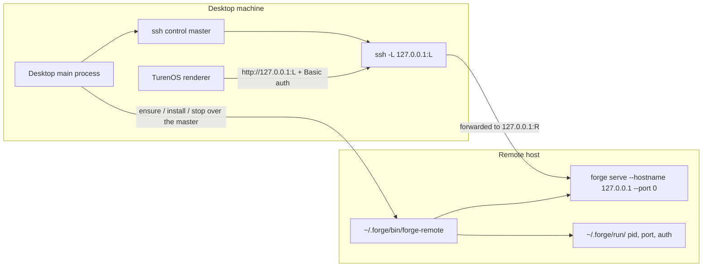

# SSH remote servers

TurenOS Desktop can run a full TurenOS backend on another machine and use it as if it were local.
The Desktop main process drives the system `ssh` client, installs and supervises `forge serve` on
the remote host, and forwards the remote listener to a loopback port on this machine. The renderer
then talks to that loopback URL through the ordinary generated HTTP/SSE client — nothing in the app
or server layers knows the connection is remote.

This is a Desktop-only feature that needs an `ssh` client on the desktop machine; the code carries
`win32` branches (`ssh.exe`, a `%TEMP%` control directory, hidden windows) alongside the POSIX path.
It requires no agent, no daemon, and no inbound port on the remote: all traffic rides one
authenticated outbound SSH connection.

Implementation lives in [`packages/desktop/src/main/ssh`](../packages/desktop/src/main/ssh) with
the UI in [`packages/app/src/ssh`](../packages/app/src/ssh).

## Shape



The remote server binds loopback only. Its sole reachable path is the SSH forward, and every request
on that forward still carries HTTP Basic auth.

## Compared with adding a server by URL

Desktop can also reach a remote backend the plain way: run `forge serve` on a reachable port and add
it as an `http` server connection. The SSH path exists because that alternative pushes real work onto
the operator.

|                    | SSH remote                                                                                        | Server added by URL                                                                                                                                                               |
| ------------------ | ------------------------------------------------------------------------------------------------- | --------------------------------------------------------------------------------------------------------------------------------------------------------------------------------- |
| Inbound exposure   | None. The remote binds `127.0.0.1` on a kernel-assigned port.                                     | A listening port must be reachable from the desktop.                                                                                                                              |
| Transport security | Encrypted, with host-key identity, by construction.                                               | `normalizeServerUrl` turns a bare `host:port` into `http://`, so Basic credentials and all session traffic cross the network in cleartext unless the operator fronts it with TLS. |
| Credentials        | Minted per start on the remote, kept memory-only on the desktop, re-read on every connect.        | `username`/`password` are persisted with the connection in the renderer's `server.v3` store.                                                                                      |
| Authentication     | Reuses existing SSH keys, agent, 2FA, and `known_hosts`. No new secret to distribute.             | A shared password the operator invents and distributes.                                                                                                                           |
| Setup              | Name a host you can already `ssh` into. forge is installed, version-matched, and started for you. | Install forge on the host, pick a port, open it through the firewall, invent and distribute a password, and arrange TLS.                                                          |
| Lifecycle          | Installs, version-checks, daemonizes, health-checks, and auto-reconnects.                         | Someone else runs, updates, and supervises the server.                                                                                                                            |
| Per-request cost   | One authenticated connection, multiplexed, `ControlPersist=10m` — auth is paid once.              | A fresh TCP connection per client, no shared auth state.                                                                                                                          |

The honest trade is throughput. Tunneling is not faster than talking to a port directly: traffic is
encrypted, crosses an extra process hop on both ends, and is subject to the SSH channel's own flow
control. What the tunnel buys is that no port is exposed, nothing needs a certificate, and the
credential that grants access is one the operator already manages. For a long-lived agent session —
mostly SSE and modest JSON — that trade is easy; for bulk file transfer it is not.

Adding a server by URL remains the right choice for a backend that is already operated behind TLS or
a reverse proxy, shared by several users, or running somewhere the user has no shell account.

## Components

| Piece                  | Responsibility                                                                                                                                                 | Source                                                            |
| ---------------------- | -------------------------------------------------------------------------------------------------------------------------------------------------------------- | ----------------------------------------------------------------- |
| `runtime.ts`           | All `ssh` process work: target parsing, `ssh -G` resolution, control master, pty prompt detection, remote command execution, remote file writes, tunnel spawn. | [`runtime.ts`](../packages/desktop/src/main/ssh/runtime.ts)       |
| `shim.ts`              | The POSIX `sh` lifecycle script written to the remote as `~/.forge/bin/forge-remote`, plus parsing of its state line.                                          | [`shim.ts`](../packages/desktop/src/main/ssh/shim.ts)             |
| `connection.ts`        | One full connect: master → refresh shim → `ensure` (installing forge if missing) → tunnel → health. Also graceful remote stop.                                 | [`connection.ts`](../packages/desktop/src/main/ssh/connection.ts) |
| `servers.ts`           | The controller: persisted server list, per-server runtime state, prompts, jobs, reconnect backoff, and the public API surface.                                 | [`servers.ts`](../packages/desktop/src/main/ssh/servers.ts)       |
| `policy.ts`            | Pure helpers: config construction from a resolved target, cached-state clearing, IPC input validation.                                                         | [`policy.ts`](../packages/desktop/src/main/ssh/policy.ts)         |
| `startup.ts`           | Pure policy: which servers auto-start, reconnect backoff schedule, health polling, post-install version assertion.                                             | [`startup.ts`](../packages/desktop/src/main/ssh/startup.ts)       |
| `ipc.ts`               | `ssh-servers-*` IPC handlers over `TrustedIpc`, including per-sender state subscriptions.                                                                      | [`ipc.ts`](../packages/desktop/src/main/ssh/ipc.ts)               |
| `packages/app/src/ssh` | Settings list, add-server dialog, global prompt host, and the state context fed by IPC events.                                                                 | [`app/src/ssh`](../packages/app/src/ssh)                          |

The controller is constructed and wired in
[`packages/desktop/src/main/index.ts`](../packages/desktop/src/main/index.ts): it gets the control
directory, the credential vault, the packaged `forge-cli` path, the app version, and the renderer
CORS origins, and it reads/writes its server list through product storage under the `ssh-servers`
key. `initialize()` runs at startup and connects every persisted server;
[`shutdown.ts`](../packages/desktop/src/main/shutdown.ts) calls `stopAll()` on quit.

## Host identity

A target is typed as `[user@]host[:port]`, including `~/.ssh/config` aliases. `parseSshTarget`
rejects anything that could smuggle options into the destination argument (leading `-`, whitespace,
a second `@`, a non-numeric colon suffix), and the destination is always passed last on the argv so
`ssh` cannot read it as an option.

`resolveSshTarget` then runs `ssh -G <destination>` and takes the effective `HostName`, `User`, and
`Port` from the user's own SSH config, so aliases, `ProxyJump`, and per-host settings behave exactly
as `ssh` defines them. The resolved values produce a canonical id:

```
ssh:user@hostname[:port]     # port omitted when 22
```

That id is the dedupe key — `myalias` and `user@203.0.113.10` resolve to the same server and cannot
be added twice — and it is also the app-level connection key (`ssh:<id-without-prefix>`), so a
remote's stored project state survives across renames of the alias.

`ssh -G`'s `identityfile` is deliberately _not_ adopted: it reports defaults like `~/.ssh/id_rsa`
even when nothing is configured, and re-passing them with `-i` narrows the auth set. Only an
explicitly entered identity file is used.

## Authentication

Every connect first tries key/agent auth in batch mode (`BatchMode=yes`, `ConnectTimeout=15`,
`StrictHostKeyChecking=ask`). If that succeeds, the control master is started as a plain child
process and no terminal is ever allocated.

If batch auth fails with a permission or connection error, the master is re-spawned under a pty
(`@lydell/node-pty`) and `detectSshPrompt` watches the output tail — SSH writes prompts without a
trailing newline, so only the last line matters. It recognizes:

- host-key confirmation (`(yes/no/[fingerprint])?`), returned with the surrounding fingerprint block,
- key passphrases,
- passwords, and keyboard-interactive second factors (verification code, OTP, passcode, smartcard PIN),
  which share the masked-input UX.

Each detected prompt becomes `state.prompt` with a fresh `requestId`, surfaces in the renderer
through [`SshPromptHost`](../packages/app/src/ssh/prompt-host.tsx) — mounted once under the shared
providers so a reconnect can prompt from anywhere in the app — and the answer routes back through
`respondPrompt`. A `null` response cancels: the ssh process is killed and the error is raised as an
`AbortError` so the controller does not retry into another prompt. `stopAll` resolves every pending
prompt with `null` rather than leaving ssh hanging at quit.

`StrictHostKeyChecking` is pinned to `ask` rather than `accept-new`: a batch run cannot answer, so
it fails fast and falls through to the pty path where the user sees the fingerprint and decides. A
_changed_ host key still hard-fails, as SSH intends.

## Connection multiplexing

All remote work for one host shares a single authenticated connection, so an interactive password is
asked for at most once. `ensureMaster` creates `-M -N -S <controlPath>` with
`ControlPersist=10m`; every later command, probe, and tunnel passes `-S <controlPath>` and
multiplexes over it.

Control sockets live in a short per-user path — `/tmp/forge-ssh-<uid>` (`%TEMP%\forge-ssh` on
Windows) — because `sockaddr_un` is capped near 104 bytes on macOS and the app data directory
overflows it. The socket name is a SHA-256 prefix of `user@host:port`. Concurrent `ensureMaster`
calls for the same socket (a probe overlapping a connect) are serialized through an in-process lock
so two pty masters never race one socket.

## The remote shim

Before anything else, the connect writes [`shim.ts`](../packages/desktop/src/main/ssh/shim.ts)'s
script to `$HOME/.forge/bin/forge-remote` (mode 0755) via `cat` over the master. It is rewritten on
every connect so an outdated copy self-heals, and it is plain POSIX `sh` because a remote may not
have `bash`. It owns four subcommands:

- **`ensure`** (default) — idempotent, and the only subcommand invoked with an environment (piped in
  on stdin; see [Keychain and key material](#keychain-and-key-material)). If a live pid and stored
  port/auth exist, it just reprints the state, so reconnects reattach to the running server instead
  of spawning a second one. Otherwise it
  creates `~/.forge/run` (0700), generates a 16-byte random password from `/dev/urandom`, and
  `nohup`s `forge serve --hostname 127.0.0.1 --port 0` with the CORS origins, then discovers the
  kernel-assigned port by tailing the server's own log line. Pid, port, and auth files are written 0600. Failure prints `FORGE_REMOTE_ERROR` plus the log tail and removes the pidfile.
- **`status`** — prints the state line if a server is alive, else exits nonzero.
- **`install <version>`** — see below.
- **`stop`** — kills the pid and removes the pid/port files.

The state line is the contract between remote and desktop:

```
FORGE_REMOTE {"port":<n>,"username":"forge","password":"<hex>"}
```

`parseRemoteState` takes the _last_ such line, so MOTD and profile noise cannot spoof the value
ahead of it. The same marker discipline applies to `FORGE_PROBE` lines from the capability probe.

The server is started with `FORGE_SERVER_USERNAME=forge`, the generated `FORGE_SERVER_PASSWORD`,
`FORGE_CLIENT=desktop`, `FORGE_EXPERIMENTAL_DISABLE_FILEWATCHER=true`,
`XDG_STATE_HOME=$HOME/.local/state`, and — when the desktop supplies them — the
`FORGE_SECRET_VAULT_KEY_ID` / `FORGE_SECRET_VAULT_KEY` pair described in
[Secure storage](./secure-storage.md), so credentials sealed by the desktop remain readable on the
remote. `remoteEnsureScript` sends them through stdin, and the shim inherits the exported variables
when it starts `forge serve`.

## Installing and updating forge on the remote

If `ensure` reports `FORGE_REMOTE_ERROR forge is not installed`, the connect runs the install path
once and retries `ensure`. Install has two ordered strategies:

1. **Shim install over curl.** `probeRemote` checks for `curl`; if present, the shim's own `install`
   subcommand downloads the release asset for the detected platform straight from
   `https://github.com/turenlabs/turenos/releases/download/v<version>`, downloads `SHA256SUMS`,
   verifies the archive with `sha256sum` or `shasum`, extracts it, asserts `forge --version` equals
   the requested version, and atomically moves the binary into `~/.forge/bin/forge`. Target detection
   covers linux/darwin × x64/arm64, Rosetta translation, non-AVX2 `-baseline` builds, and musl
   (`-musl`) hosts. A checksum mismatch, a version mismatch, or a symlinked payload aborts the
   install. Being self-contained, the remote never depends on the published install script being
   current.
2. **Same-arch binary stream.** Packaged desktop builds carry a `forge-cli` binary in
   `process.resourcesPath`. When the remote's `uname -sm` maps to the same target as this machine and
   no `curl` is available, that binary is streamed to `~/.forge/bin/forge` over the master
   (temp file, `chmod`, atomic `mv`). Dev builds pass `localForgeBinary: null`, since
   `FORGE_CLI_COMMAND` resolves to `bun` locally and is useless on a remote.

If neither applies, the error names the manual fallback (`curl -fsSL …/install | bash`).

The same install path is exposed as an explicit action: settings show the remote's detected forge
path and version against the desktop version, and **Install/Update** runs `installForge`, re-probes,
asserts via `expectSshForgeVersion` that the remote now reports the expected version — failing
loudly if it does not — and restarts the server.

## Tunnel and readiness

With a port in hand the desktop allocates a free loopback port locally (bind :0, read it, close) and
spawns the forward over the master:

```
ssh -S <controlPath> -L 127.0.0.1:<local>:127.0.0.1:<remote> \
    -o ExitOnForwardFailure=yes -o ServerAliveInterval=15 \
    -o ServerAliveCountMax=2 -o TCPKeepAlive=yes <dest> 'while :; do sleep 86400; done'
```

Two details are load-bearing. A multiplexed `-N` session exits immediately because there is no
command channel to hold, so a remote sleep loop keeps the child alive and makes _its_ exit a
reliable signal that the connection dropped. And forwards registered through the mux outlive the
session that created them, so on exit the desktop explicitly issues `-O cancel -L <spec>` — otherwise
the local port stays bound and the next connect cannot re-register it.

Startup then races three outcomes: health polling against `GET /global/health` with Basic auth
(`forge:<password>`, 100 ms interval), a 20-second timeout, and tunnel exit. Whichever settles first
wins; a timeout or early exit stops the tunnel and surfaces the summarized ssh stderr.

## Runtime state and recovery

Each server carries one runtime state: `starting`, `ready` (with the loopback `url`, `username`,
`password`), `failed` (with a message), or `stopped`. Only `ready` servers are projected into the
app's server list by
[`readySshConnections`](../packages/desktop/src/renderer/ssh/connections.ts).

A dropped tunnel or a failed connect schedules a bounded reconnect on the
`1s, 3s, 10s, 30s, 60s, 60s` schedule — deliberately stretched past a minute so a laptop
sleep/wake recovers without user action — and the counter only resets once a connection actually
reaches `ready`. Two cases never retry: a user-cancelled prompt (retrying would just re-prompt) and
an exhausted schedule. Stale work is discarded by a per-server start-attempt counter, so a removal
or restart during an in-flight connect closes the late connection instead of adopting it.

`stopRemote` kills the remote server (`forge-remote stop`) and closes the master; the server stays
configured and can be started again. `removeServer` drops it from storage and clears cached probes
and version checks, and passes `reachable: false` so removal _never_ re-authenticates — a removal
must not pop a password prompt. When the master is already alive the stop still runs over it;
otherwise the daemonized remote is left running and will be reattached (or stopped) on re-add.

Because `ensure` is idempotent and the remote is daemonized with `nohup`, quitting the desktop does
not kill the remote server. The next launch auto-connects every persisted server and reattaches.

## Surface

The controller's API is exposed to the renderer through `TrustedIpc` handlers
(`ssh-servers-get-state`, `-subscribe`, `-probe-runtime`, `-probe-host`, `-add`, `-remove`,
`-start`, `-stop-remote`, `-install-forge`, `-respond-prompt`) and the preload bridge, and typed as
`SshServersPlatform` on the platform context. IPC inputs are validated at the boundary by
`requireSshIpcString` / `requireSshIpcTarget` — host must be a non-empty string, port must be an
integer in 1–65535 — before reaching any ssh code. Subscriptions are per-sender and torn down when
the renderer is destroyed or the app quits.

State flows one way: the controller mutates its `SshServersState` and emits it, the IPC layer pushes
`ssh-servers-event` to subscribed senders, and
[`SshServersProvider`](../packages/app/src/ssh/context.tsx) writes it straight into the query cache,
so the settings list, the add dialog, and the prompt host all read one snapshot.

At most one long-running _job_ (host probe or forge install) runs at a time; starting a new one
aborts the previous through its `AbortController`.

## Attaching from the remote host

The server the desktop starts is an ordinary `forge serve` with Basic auth, so anything running on
the remote host as the same user can use it directly — a TUI, a script, or a second `forge`
invocation. There is no separate API for this and none is needed.

Discovery goes through the shim rather than through the state files, because `status` also verifies
the pid is alive:

```sh
sh ~/.forge/bin/forge-remote status
# FORGE_REMOTE {"port":41237,"username":"forge","password":"a3f1..."}
```

The CLI already consumes a running server this way. `forge run --attach <url>` skips loading a local
instance entirely and builds a client against the given base URL with
[`ServerAuth.headers`](../packages/server/src/auth.ts):

```sh
forge run --attach "http://127.0.0.1:$(cat ~/.forge/run/server.port)" \
  -u forge -p "$(cat ~/.forge/run/server.auth)" "hello"
```

Under `--attach`, `--dir` is interpreted as a path _on the server_, not locally. A client sharing the
host's filesystem is the normal case here; see
[`packages/forge/src/cli/cmd/run.ts`](../packages/forge/src/cli/cmd/run.ts).

Because it is one process over one SQLite database, a local client and the desktop (through its
tunnel) observe the same Sessions live.

Four constraints shape any client built on this:

- **Port and password rotate on every remote restart.** Resolve them at connect time; never cache
  them across restarts.
- **The desktop owns the lifecycle.** `ensure` is idempotent, so attaching does not disturb it — but
  the desktop's "stop remote" or server removal kills the process the client is attached to.
- **The state files are 0600**, owned by the user the desktop connects as. A different user on the
  same host cannot read them, and loopback binding plus Basic auth leaves no other way in.
- **Starting the server by hand needs a vault key.** Running `forge-remote ensure` without
  `FORGE_SECRET_VAULT_KEY_ID` and `FORGE_SECRET_VAULT_KEY` fails with
  `Persistent secret storage requires an OS-protected key`, and supplying a _different_ key than the
  one that sealed existing credentials fails with `Stored credentials belong to another
OS-protected key`. For a host that must also work standalone, provision one stable key and point
  the desktop at it too — the desktop honors those variables from its own environment
  ([`main/index.ts`](../packages/desktop/src/main/index.ts)) — accepting that this bypasses
  `safeStorage` on the desktop side.

A client that tries `forge-remote status` first and falls back to `FORGE_SERVER_*` environment
variables works unchanged against both a desktop-managed remote and a hand-run `forge serve`.

## Keychain and key material

Two different keychains touch this path, and neither one stores the remote's credentials.

**The OS keychain, through the credential vault.** The desktop's root secret is a random 32-byte key
wrapped by Electron `safeStorage` — the macOS Keychain item `Forge Safe Storage`, Windows DPAPI, or
libsecret/KWallet on Linux — and stored in `forge.settings` as `{version, keyID, wrappedKey}`. It is
unwrapped once at startup by
[`loadCredentialSecretKey`](../packages/desktop/src/main/secret-key.ts), so keychain prompts (if any)
happen at app launch, never per connect. A remote host has no keychain of its own: the SSH connect
ships `FORGE_SECRET_VAULT_KEY_ID` and the base64 key into the remote `ensure` command, and the
headless server reads exactly those two variables in
[`secret-vault.ts`](../packages/core/src/secret-vault.ts), deleting them from `process.env` as the
vault layer initializes. Without them, non-test startup fails rather than falling back to plaintext.

The consequence is that a remote's sealed credentials belong to _this desktop's_ keychain item. The
remote records the `keyID` it was first sealed with (`claimVault` in
[`packages/forge/src/auth/index.ts`](../packages/forge/src/auth/index.ts)); connecting with a
different key fails with `Stored credentials belong to another OS-protected key`. A second machine
therefore cannot silently adopt a remote that already holds credentials, and losing or rotating the
desktop keychain item strands the remote's sealed data. See
[Secure storage](./secure-storage.md) for the vault format and platform prompt behavior.

**The user's SSH keychain and agent — unmanaged.** TurenOS never runs `ssh-add`, never sets
`UseKeychain` or `AddKeysToAgent`, and never stores an SSH secret. Child processes inherit the
desktop's environment, so `SSH_AUTH_SOCK` is whatever launched the app; on macOS a Dock or Finder
launch inherits launchd's agent, which is where `ssh-add --apple-use-keychain` keys live. When the
key is loaded there, batch auth succeeds and the user sees no prompt at all. When it is not, the
in-app prompt collects the passphrase, writes it to the pty, and drops it — it is never persisted,
so the same passphrase is requested on the next connect. Loading the key into the agent, not
TurenOS, is what makes that prompt go away.

**The remote's HTTP password is not keychain material.** It is minted per start on the remote, kept
0600 in `~/.forge/run/server.auth`, returned over the SSH channel, and held only in main-process
memory and the mirrored renderer state. It is never written to local storage, and a remote restart
mints a new one.

**Key material never reaches argv.** The `ensure` call is the only step that carries the vault key,
and it is delivered the way the WSL backend delivers it — as a short script on stdin, built by
`remoteEnsureScript` and piped to `sh -s`:

```sh
FORGE_REMOTE_CORS='forge://- http://localhost:5173'
FORGE_SECRET_VAULT_KEY_ID='...'
FORGE_SECRET_VAULT_KEY='...'
export FORGE_REMOTE_CORS FORGE_SECRET_VAULT_KEY_ID FORGE_SECRET_VAULT_KEY
exec sh "$HOME/.forge/bin/forge-remote" ensure
```

The ssh command argument is the literal string `sh -s`, so neither the local `ssh` process nor the
remote login shell ever holds the key in a command line where `ps` could read it. Values are
single-quote escaped, so a quote in an origin cannot break out into the remote shell. Passing the
assignments as a `VAR=value cmd` prefix would also have required a POSIX login shell; piping works
under csh-family shells too.

Env delivery still means the key is present in the remote server process's own environment, which is
inherent to the headless contract — `forge serve` reads those two variables and nothing else. It is
readable there by that user and by root on the remote, as it is for any headless deployment.

## Security properties

- The remote listener binds `127.0.0.1` with a kernel-assigned port and is reachable only through
  the SSH forward; its state files are 0600 under a 0700 directory.
- Every request still carries HTTP Basic auth with a per-start 16-byte random password.
- CORS is restricted to the renderer origins the desktop actually uses.
- Destination arguments cannot inject ssh options; the destination is always the final argv element.
- Host keys are never silently accepted — the user confirms a new key with the fingerprint in view,
  and changed keys fail.
- The credential vault key is propagated so remote-stored secrets share the desktop's OS-protected
  key, and it travels on stdin rather than in any command line.
- Renderer IPC arrives through `TrustedIpc` and is validated before use.

## Operating notes

- `ssh -V` availability is surfaced as `state.runtime`; without an ssh client nothing else is
  attempted.
- Remote logs live at `~/.forge/run/server.log` (level `WARN`, overridable via
  `FORGE_REMOTE_LOG_LEVEL`); the shim tails them into the error when startup fails.
- ssh stderr is summarized to the last six meaningful lines, with known-harmless noise
  (inaccessible default identity files, `Permanently added … to the list of known hosts`) filtered
  out.
- To clear a wedged remote by hand: `rm -f ~/.forge/run/server.pid ~/.forge/run/server.port` after
  killing the process, or run `sh ~/.forge/bin/forge-remote stop`.

## Tests

Behavior is covered without mocking ssh itself:
[`runtime.test.ts`](../packages/desktop/src/main/ssh/runtime.test.ts) for parsing, id
canonicalization, prompt detection, and `ssh -G` handling;
[`shim.test.ts`](../packages/desktop/src/main/ssh/shim.test.ts) executes the real shim script
against fixtures (daemonize, reattach, stale pidfile, checksum rejection);
[`servers.test.ts`](../packages/desktop/src/main/ssh/servers.test.ts) drives the controller through
its test seams for add/remove, prompt round-trips, reconnect backoff, late-connection discard, and
install version enforcement.
