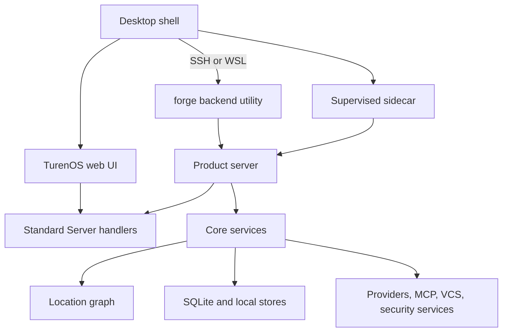
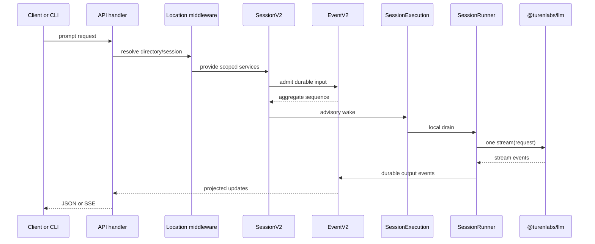
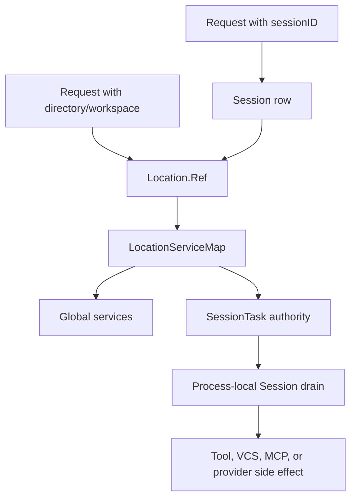

# TurenOS systems catalog

<!-- long-page: reference -->

This catalog names the current TurenOS systems and the seams between them. "Owner" means the
package or runtime service that owns the state transition or policy boundary; it does not mean that
all work executes in one process. For source-level details, follow the links in the last column.

Identifiers in backticks are intentionally exact. A path such as `packages/forge`, an API name such
as `ForgeHttpApi`, or a serialized value such as `forge-secret:v1` is not product copy and must keep
its compatibility spelling. See [Branding](../architecture/branding.md).

## Runtime map

TurenOS is the user-facing web UI and Desktop application. The `forge` CLI is a supporting utility
for headless servers, SSH/WSL backends, and backend administration, not a parallel user-facing
product. Desktop loads its local server directly in an Electron utility process; SSH and managed
WSL backends use the native executable's `serve` command. The CLI catalog below describes commands
that still exist, not a requirement to preserve a separate CLI product. See
[Architecture](../architecture/README.md#system-shape) for process boundaries and
[Branding](../architecture/branding.md#product-and-backend-roles) for naming policy.

A single process can contain more than one graph. The graph is assembled by Effect layers and
`LayerNode` tags, while HTTP middleware supplies the Location graph for each request. The desktop
sidecar supervises the product server but does not create a separate session implementation.

## System and subsystem catalog

| System or subsystem                  | Responsibilities                                                                                                                                                                                                 | Inputs and outputs                                                                                                                                                                                                              | Owner and failure behavior                                                                                                                                                                                                                                                                                                 | Source                                                                                                                                                                                                                                                                                                                                                                                                                                                                                                                                                            |
| ------------------------------------ | ---------------------------------------------------------------------------------------------------------------------------------------------------------------------------------------------------------------- | ------------------------------------------------------------------------------------------------------------------------------------------------------------------------------------------------------------------------------- | -------------------------------------------------------------------------------------------------------------------------------------------------------------------------------------------------------------------------------------------------------------------------------------------------------------------------- | ----------------------------------------------------------------------------------------------------------------------------------------------------------------------------------------------------------------------------------------------------------------------------------------------------------------------------------------------------------------------------------------------------------------------------------------------------------------------------------------------------------------------------------------------------------------- |
| Desktop shell                        | Creates the Electron application, owns BrowserWindows, preload, menus, updater, crash/log handling, and shutdown.                                                                                                | Inputs: OS lifecycle, renderer requests, deep links. Outputs: windows, IPC replies, sidecar commands, packaged app state.                                                                                                       | Owner: `packages/desktop`. Invalid renderer navigation, untrusted IPC senders, or failed external URLs are rejected or opened externally; teardown has bounded timeouts.                                                                                                                                                   | [`packages/desktop/src/main/index.ts`](../../packages/desktop/src/main/index.ts), [`packages/desktop/src/main/windows.ts`](../../packages/desktop/src/main/windows.ts)                                                                                                                                                                                                                                                                                                                                                                                            |
| Sidecar supervisor                   | Starts the product server lazily, prepares server environment, reports readiness, watches the Electron parent, and stops on orphaning.                                                                           | Inputs: start/stop messages with host, port, password, user-data path, and vault key. Outputs: ready, stopped, or serialized error messages.                                                                                    | Owner: `packages/desktop/src/main/sidecar.ts`. Import/listen failures are sent to the parent and terminate the sidecar; a missing parent receives a bounded orphan-stop path.                                                                                                                                              | [`packages/desktop/src/main/sidecar.ts`](../../packages/desktop/src/main/sidecar.ts)                                                                                                                                                                                                                                                                                                                                                                                                                                                                              |
| CLI                                  | Exposes `forge` commands for agent runs, serving, sessions, providers, plugins, MCP, database operations, import/export, and diagnostics.                                                                        | Inputs: argv, `FORGE_*` environment, config, filesystem. Outputs: terminal output, server listeners, durable sessions, files, and exit codes.                                                                                   | Owner: `packages/forge`. Yargs rejects unknown or malformed input; command failures are formatted and set a nonzero exit code. The command name is a compatibility seam.                                                                                                                                                   | [`packages/forge/src/index.ts`](../../packages/forge/src/index.ts), [`packages/forge/src/cli/cmd/run.ts`](../../packages/forge/src/cli/cmd/run.ts)                                                                                                                                                                                                                                                                                                                                                                                                                |
| Product HTTP server                  | Composes root, instance, event, PTY, security, sync, and standard API routes; owns listener lifecycle and per-listener service graphs.                                                                           | Inputs: HTTP requests, WebSocket upgrades, CORS options, auth configuration. Outputs: typed JSON, SSE, WebSocket streams, and OpenAPI at `/doc`.                                                                                | Owner: `packages/forge/src/server`. Listener construction uses a fresh scope and memo map; layer construction or route errors fail listener startup and close its scope.                                                                                                                                                   | [`packages/forge/src/server/server.ts`](../../packages/forge/src/server/server.ts), [`packages/forge/src/server/routes/instance/httpapi/server.ts`](../../packages/forge/src/server/routes/instance/httpapi/server.ts)                                                                                                                                                                                                                                                                                                                                            |
| Standard API contract                | Defines reusable `server.*` groups and middleware positions for health, locations, agents, sessions, messages, permissions, files, commands, events, PTYs, questions, project copies, memory, and loops.         | Inputs: Protocol schemas and middleware service keys. Outputs: `HttpApi` definitions consumed by Server handlers and Client generation.                                                                                         | Owner: `packages/protocol`. It has no concrete database or Location implementation; missing required client middleware is rejected during generation.                                                                                                                                                                      | [`packages/protocol/src/api.ts`](../../packages/protocol/src/api.ts), [`packages/protocol/src/groups/session.ts`](../../packages/protocol/src/groups/session.ts)                                                                                                                                                                                                                                                                                                                                                                                                  |
| Standard API handlers                | Binds typed Protocol operations to Core services, including session creation, listing, replay, terminal access, permission, memory, and event handling.                                                          | Inputs: decoded route context, query, payload, and middleware-provided services. Outputs: schemas, errors, no-content responses, or streams.                                                                                    | Owner: `packages/server`. Domain failures map to Protocol errors; invalid session/location identifiers fail before service execution.                                                                                                                                                                                      | [`packages/server/src/handlers.ts`](../../packages/server/src/handlers.ts), [`packages/server/src/handlers/session.ts`](../../packages/server/src/handlers/session.ts)                                                                                                                                                                                                                                                                                                                                                                                            |
| Client transport                     | Presents generated Promise and Effect clients to the renderer and SDK consumers without importing Core or Server runtime code.                                                                                   | Inputs: Client API contract, request values, response streams. Outputs: typed HTTP calls, decoded errors, SSE values.                                                                                                           | Owner: `packages/client`. Unsupported or malformed responses become `ClientError`; generated drift is a build/check failure rather than a runtime fallback.                                                                                                                                                                | [`packages/client/src/contract.ts`](../../packages/client/src/contract.ts), [`packages/client/script/build.ts`](../../packages/client/script/build.ts)                                                                                                                                                                                                                                                                                                                                                                                                            |
| Schema contracts                     | Defines branded IDs, JSON codecs, event definitions, session messages, permissions, locations, extension manifests, and error payloads.                                                                          | Inputs: unknown wire or persisted values. Outputs: validated typed values or decode failures.                                                                                                                                   | Owner: `packages/schema`. Decode failure is explicit; callers must not treat an invalid value as an unscoped or permissive default.                                                                                                                                                                                        | [`packages/schema/src/index.ts`](../../packages/schema/src/index.ts), [`packages/schema/src/session-event.ts`](../../packages/schema/src/session-event.ts)                                                                                                                                                                                                                                                                                                                                                                                                        |
| Global service graph                 | Provides process/database-wide services such as Database, EventV2, Memory, Loop, task coordination, TeamBoard, and LocationServiceMap.                                                                           | Inputs: process configuration and global storage. Outputs: global services and references to Location graphs.                                                                                                                   | Owner: `packages/core`. A required layer or dependency failure prevents the graph from building; global state is not silently replaced by a different Location.                                                                                                                                                            | [`packages/server/src/routes.ts`](../../packages/server/src/routes.ts), [`packages/core/src/location-services.ts`](../../packages/core/src/location-services.ts)                                                                                                                                                                                                                                                                                                                                                                                                  |
| Location service graph               | Provides directory/workspace-scoped Config, Policy, Agent, Catalog, tools, MCP, LSP, snapshots, permissions, questions, and session-facing services.                                                             | Inputs: `Location.Ref` with directory and optional workspace ID. Outputs: isolated service implementations for that reference.                                                                                                  | Owner: `packages/core`. Location resolution errors prevent request execution; the map caches and disposes scoped layers rather than sharing mutable Location state accidentally.                                                                                                                                           | [`packages/core/src/location-services.ts`](../../packages/core/src/location-services.ts), [`packages/core/src/location.ts`](../../packages/core/src/location.ts)                                                                                                                                                                                                                                                                                                                                                                                                  |
| Project identity                     | Discovers Git repositories, resolves a stable project ID, tracks worktree/common-directory identity, and supplies VCS metadata to Location.                                                                      | Inputs: opened directory, Git discovery, remembered identity, legacy markers, remote URL. Outputs: project ID, worktree, common directory, and optional VCS record.                                                             | Owner: `ProjectV2` in Core. A remembered identity wins over a changed remote; no repository resolves to the global project identity.                                                                                                                                                                                       | [`packages/core/src/project.ts`](../../packages/core/src/project.ts), [`packages/core/src/project/directories.ts`](../../packages/core/src/project/directories.ts)                                                                                                                                                                                                                                                                                                                                                                                                |
| Legacy instance lifecycle            | Loads one directory instance, resolves project/sandbox context, boots instance services, caches concurrent loads, and disposes or reloads instances.                                                             | Inputs: directory, optional worktree/project override. Outputs: `InstanceContext` and per-instance V1 services.                                                                                                                 | Owner: `packages/forge/src/project/instance-store.ts`. Failed boot entries are removed so a later load can retry; disposal runs after responses where required.                                                                                                                                                            | [`packages/forge/src/project/instance-store.ts`](../../packages/forge/src/project/instance-store.ts), [`packages/forge/src/server/routes/instance/httpapi/lifecycle.ts`](../../packages/forge/src/server/routes/instance/httpapi/lifecycle.ts)                                                                                                                                                                                                                                                                                                                    |
| Database and migrations              | Opens SQLite, configures primary/readers, applies migrations, checkpoints WAL, protects files, and exposes the Drizzle schema.                                                                                   | Inputs: selected database path, `FORGE_DB`, channel, reader configuration. Outputs: primary transaction handle, read-only replicas, schema tables, and migration state.                                                         | Owner: `packages/core/src/database`. Invalid or nonempty unknown databases fail closed; migration work is serialized, and shutdown checkpoint may defer if another connection is active.                                                                                                                                   | [`packages/core/src/database/database.ts`](../../packages/core/src/database/database.ts), [`packages/core/src/database/migration.ts`](../../packages/core/src/database/migration.ts)                                                                                                                                                                                                                                                                                                                                                                              |
| EventV2 durable log                  | Assigns aggregate sequences, encodes versioned durable event types, commits projectors atomically, publishes wakeups, and supports exact replay.                                                                 | Inputs: event definition, typed data, aggregate, optional Location and commit callback. Outputs: durable event payload, projections, pubsub notifications, and sync envelope candidates.                                        | Owner: `packages/core/src/event.ts`. Invalid aggregate data, sequence mismatch, ownership mismatch, or divergent replay is a defect/failure; stale exact retries are idempotent only when all identity and data fields match.                                                                                              | [`packages/core/src/event.ts`](../../packages/core/src/event.ts), [`packages/schema/src/event.ts`](../../packages/schema/src/event.ts)                                                                                                                                                                                                                                                                                                                                                                                                                            |
| Event bridge and streams             | Adds routed Location metadata to product events, sends local events to the global bus, emits eligible sync records, and serves location-aware SSE.                                                               | Inputs: Core events, instance context, workspace context, SSE subscribers. Outputs: local bus events, sync payloads, connected/heartbeat/disposed SSE messages.                                                                 | Owner: `packages/forge/src/event-v2-bridge.ts` and product event handlers. Unlocated events are dropped from instance streams and warned about; SSE uses `no-store` and filters by directory/workspace.                                                                                                                    | [`packages/forge/src/event-v2-bridge.ts`](../../packages/forge/src/event-v2-bridge.ts), [`packages/forge/src/server/routes/instance/httpapi/handlers/event.ts`](../../packages/forge/src/server/routes/instance/httpapi/handlers/event.ts)                                                                                                                                                                                                                                                                                                                        |
| Session V2 admission                 | Creates Sessions, reconciles exact prompt retries, records prompt/command/goal inputs, and separates durable admission from execution.                                                                           | Inputs: Session ID, message ID, prompt, delivery mode, agent/model selection, source, and Location. Outputs: `session_input`, identity records, admission events, and an advisory execution wake.                               | Owner: `SessionV2` and `SessionInput` in Core. Conflicting reuse, wrong Session, or wrong delivery mode fails; exact same retries return the existing admission without duplicate work.                                                                                                                                    | [`packages/core/src/session.ts`](../../packages/core/src/session.ts), [`packages/core/src/session/input.ts`](../../packages/core/src/session/input.ts), [`packages/schema/src/session-input.ts`](../../packages/schema/src/session-input.ts)                                                                                                                                                                                                                                                                                                                      |
| Session execution coordinator        | Owns one process-local drain per Session ID, joins explicit resumes, coalesces wakeups, allows different Sessions to run concurrently, and interrupts active ownership.                                          | Inputs: Session ID, explicit resume, advisory wake, forced follow-up, retry, or interrupt. Outputs: run join handles and provider/tool work scheduled in the local process.                                                     | Owner: `SessionRunCoordinator` and `SessionExecutionLocal`. A provider/tool failure does not become an automatic crash-recovery retry; idle interruption is a no-op.                                                                                                                                                       | [`packages/core/src/session/run-coordinator.ts`](../../packages/core/src/session/run-coordinator.ts), [`packages/core/src/session/execution/local.ts`](../../packages/core/src/session/execution/local.ts)                                                                                                                                                                                                                                                                                                                                                        |
| Session runner                       | Reloads projected history, assembles system context, resolves model/tools/permissions, streams one provider turn, persists stream events, settles tools, and evaluates continuation.                             | Inputs: Session ID, Location services, projected messages, agent/model selection, harness, context epoch, and execution control. Outputs: LLM events, durable session events, projected messages, tool settlements, and status. | Owner: `SessionRunner` in Core. Provider failures, blocked permissions, malformed tool results, and interruption settle the run; the runner does not delegate orchestration to the legacy prompt loop.                                                                                                                     | [`packages/core/src/session/runner/llm.ts`](../../packages/core/src/session/runner/llm.ts), [`packages/core/src/session/runner/model.ts`](../../packages/core/src/session/runner/model.ts)                                                                                                                                                                                                                                                                                                                                                                        |
| Session projection and history       | Projects durable events into Session, message, part, usage, status, input, and compaction tables, then selects model-visible history.                                                                            | Inputs: versioned Session events and context epoch/compaction rows. Outputs: visible transcript, provider history, usage totals, and replay data.                                                                               | Owner: `SessionProjector` and `SessionHistory`. Projection failure aborts the event transaction; decode failure is surfaced as `MessageDecodeError` instead of returning partial history.                                                                                                                                  | [`packages/core/src/session/projector.ts`](../../packages/core/src/session/projector.ts), [`packages/core/src/session/history.ts`](../../packages/core/src/session/history.ts)                                                                                                                                                                                                                                                                                                                                                                                    |
| Model and provider layer             | Maintains provider/model catalog data, applies provider policy and integrations, resolves a model, and delegates canonical messages to `@turenlabs/llm`.                                                         | Inputs: catalog state, provider credentials/connections, model ref, agent settings, and LLM request. Outputs: provider stream, usage, tool calls, errors, and metadata.                                                         | Owner: Core catalog/model services plus `packages/llm` and the product provider adapters. Unavailable credentials/models fail resolution or streaming; provider-side work is not assumed safe merely because no local tool event was emitted.                                                                              | [`packages/core/src/catalog.ts`](../../packages/core/src/catalog.ts), [`packages/core/src/session/runner/model.ts`](../../packages/core/src/session/runner/model.ts), [`packages/llm/src/llm.ts`](../../packages/llm/src/llm.ts), [`docs/systems/model-provider-layer/README.md`](./model-provider-layer/README.md)                                                                                                                                                                                                                                               |
| Tool Registry                        | Materializes canonical built-in, plugin, MCP, and session tools for a provider turn and provides the common settlement boundary.                                                                                 | Inputs: permission rules, agent, Session ID, current turn tool snapshot, tool definitions, and provider ToolCall. Outputs: validated result, bounded output, output paths, and interceptor events.                              | Owner: `ToolRegistry` in Core for V2 and `packages/forge` for legacy. Unknown/stale tools do not execute; schema/permission/interceptor failures become visible tool errors or run failures.                                                                                                                               | [`packages/core/src/tool/registry.ts`](../../packages/core/src/tool/registry.ts), [`packages/forge/src/tool/registry.ts`](../../packages/forge/src/tool/registry.ts), [`docs/systems/shell-tool-routing.md`](./shell-tool-routing.md)                                                                                                                                                                                                                                                                                                                             |
| CodeMode                             | Executes bounded JavaScript programs over explicit host-supplied tools and exposes tool discovery.                                                                                                               | Inputs: tool tree, program, schemas, and optional limits. Outputs: plain-data result, tool-call records, or diagnostics.                                                                                                        | Owner: `packages/codemode`. Programs cannot acquire ambient host authority; the host authorizes tools and owns external side effects.                                                                                                                                                                                      | [CodeMode](./codemode/README.md), [`packages/codemode/src/codemode.ts`](../../packages/codemode/src/codemode.ts)                                                                                                                                                                                                                                                                                                                                                                                                                                                  |
| Permission service                   | Evaluates wildcard rules, merges agent/task/hard permissions, asks the user when required, and persists durable permission events and saved rules.                                                               | Inputs: action/resource, Session ID, agent, task authority, saved rules, and user reply. Outputs: allow/ask/deny decision, pending request, or typed rejection/correction.                                                      | Owner: Core `PermissionV2`; legacy product permission service remains for compatibility. Deny wins over ask and allow across effective rulesets; missing decisions default to ask in V2 and agent defaults can be deny-all.                                                                                                | [`packages/core/src/permission.ts`](../../packages/core/src/permission.ts), [`packages/forge/src/permission/index.ts`](../../packages/forge/src/permission/index.ts)                                                                                                                                                                                                                                                                                                                                                                                              |
| Shell safety                         | Statically inspects every shell command before it runs and refuses recursive deletion of anything that is not a literal direct child of the working directory or a temporary directory.                          | Inputs: command string and resolved working directory. Outputs: pass, or a typed `recursive-delete` violation returned to the agent.                                                                                            | Owner: Core `ShellSafety`, called by the V2 `bash` and V1 `shell` tools. Runs before `ShellToolRouting` and `PermissionV2` and cannot be overridden; it judges nothing but recursive deletion.                                                                                                                             | [`packages/core/src/shell-safety.ts`](../../packages/core/src/shell-safety.ts), [`packages/core/src/filesystem/protected.ts`](../../packages/core/src/filesystem/protected.ts), [`docs/systems/dangerous-commands/README.md`](./dangerous-commands/README.md)                                                                                                                                                                                                                                                                                                     |
| Tool execution ledger                | Claims a stable `(sessionID, assistantMessageID, callID)` identity, prevents conflicting retries, leases running work, and stores settlements.                                                                   | Inputs: tool identity, request hash, retry policy, and execution effect. Outputs: completed settlement, joined result, running/indeterminate state, or conflict.                                                                | Owner: Core `ToolExecution`. Exact retries can join or reuse completed results; changed inputs conflict, expired non-retryable work becomes indeterminate, and transaction failure marks owned work indeterminate.                                                                                                         | [`packages/core/src/tool/execution.ts`](../../packages/core/src/tool/execution.ts), [`packages/core/src/tool/execution.sql.ts`](../../packages/core/src/tool/execution.sql.ts)                                                                                                                                                                                                                                                                                                                                                                                    |
| Tool output store                    | Bounds large text or structured output, persists the full output to a managed file, returns head/tail preview, and removes old files.                                                                            | Inputs: tool output, configured max lines/bytes, Session and call IDs. Outputs: inline output or preview plus an output path.                                                                                                   | Owner: Core `ToolOutputStore`. Encode/write failures are typed storage failures; cleanup is periodic and best-effort. The store bounds display/storage copies but does not sandbox command authority.                                                                                                                      | [`packages/core/src/tool-output-store.ts`](../../packages/core/src/tool-output-store.ts)                                                                                                                                                                                                                                                                                                                                                                                                                                                                          |
| Background shell jobs                | Runs approved `bash` commands as durable, Session-owned jobs: commands that finish within one second return inline, longer ones return a `job_id` that `shell_job` can list, inspect, wait on, read, and cancel. | Inputs: approved command, working directory, timeout, `foreground` flag, and tool-call identity. Outputs: inline output or `job_id`, job state, bounded output, and an advisory completion notice to the owning Session.        | Owner: Core `ShellJob` and the `shell_job` tool. At most 4 active jobs per Session and 32 across the runner; other Sessions cannot read or cancel a job; a repeated tool-call identity reconciles the existing job; lost ownership after restart is reported as `interrupted` and never replayed.                          | [`packages/core/src/shell-job.ts`](../../packages/core/src/shell-job.ts), [`packages/core/src/background-job.ts`](../../packages/core/src/background-job.ts), [`packages/core/src/tool/shell-job.ts`](../../packages/core/src/tool/shell-job.ts), [`docs/systems/shell-jobs.md`](./shell-jobs.md)                                                                                                                                                                                                                                                                 |
| Extension catalog and runtime        | Validates manifests, exposes catalog contributions, stores desired enablement/configuration, and seals declared secrets.                                                                                         | Inputs: built-in/generated manifests, installed manifests, configuration, secret updates, and local admission context. Outputs: enabled tools, MCP/data/skill contributions, configuration, and secret availability.            | Owner: `@turenlabs/extensions` plus Core ExtensionRuntime. Invalid manifests, undeclared config/secrets, nonlocal updates, or policy violations fail without partial installation.                                                                                                                                         | [`packages/extensions/src/validate.ts`](../../packages/extensions/src/validate.ts), [`packages/core/src/extension.ts`](../../packages/core/src/extension.ts), [`docs/systems/developer-catalog-runtime/README.md`](./developer-catalog-runtime/README.md)                                                                                                                                                                                                                                                                                                         |
| Repository plugin trust              | Scans repository plugin files, computes a fingerprint, records explicit allow/deny decisions, and rejects stale decisions.                                                                                       | Inputs: repository directory/root, manifest files, plugin files, fingerprint, and decision. Outputs: pending/trusted/denied/invalid status.                                                                                     | Owner: Core `PluginTrust`. Scan limits and invalid roots fail closed; a decision for a changed fingerprint raises a stale-fingerprint error and cannot silently carry trust forward.                                                                                                                                       | [`packages/core/src/plugin/trust.ts`](../../packages/core/src/plugin/trust.ts)                                                                                                                                                                                                                                                                                                                                                                                                                                                                                    |
| MCP integration and broker           | Discovers configured capabilities, filters and sanitizes definitions, selects per-Session tools, manages transports/auth, and connects hosted/local/managed servers.                                             | Inputs: extension manifests, MCP config, Session ID, query, selected keys, settings, and declared secrets. Outputs: capability search/load result, MCP tool definitions, resources, tool results, and connection status.        | Owner: `packages/forge/src/mcp`. Unknown tools, per-Session/per-server limits, unsupported platforms, bad auth, and disallowed endpoints fail closed; external MCP content is untrusted.                                                                                                                                   | [`packages/forge/src/mcp/broker.ts`](../../packages/forge/src/mcp/broker.ts), [`packages/forge/src/mcp/integration.ts`](../../packages/forge/src/mcp/integration.ts), [`packages/forge/src/mcp/index.ts`](../../packages/forge/src/mcp/index.ts)                                                                                                                                                                                                                                                                                                                  |
| Managed MCP runtime                  | Qualifies selectable backends, attaches isolated process/container configuration, supplies secrets and bounded environment, and invalidates active connections on generation change.                             | Inputs: managed recipe, Docker/local settings, package pin, environment, and secret map. Outputs: resolved command/cwd/environment and connection generation.                                                                   | Owner: `packages/forge/src/mcp/runtime.ts` and `package-runtime.ts`. Unsupported or unqualified backend is unavailable; recipe identity and package pin are source-controlled, not manifest-selected.                                                                                                                      | [`packages/forge/src/mcp/runtime.ts`](../../packages/forge/src/mcp/runtime.ts), [`packages/forge/src/mcp/package-runtime.ts`](../../packages/forge/src/mcp/package-runtime.ts)                                                                                                                                                                                                                                                                                                                                                                                    |
| Memory                               | Stores project-scoped wings, rooms, and drawers; provides temporal/provenance-aware lexical search and rebuildable indexes.                                                                                      | Inputs: Location-derived project wing, room, drawer body, provenance, validity window, scoped search/read request. Outputs: durable drawers, search results, updates, and deletion state.                                       | Owner: Core Memory. Empty or missing scope returns no memories; invalid room or update version fails; FTS/semantic indexes are derived from durable drawers and can be rebuilt.                                                                                                                                            | [`packages/core/src/memory/index.ts`](../../packages/core/src/memory/index.ts), [`docs/systems/memory.md`](./memory.md)                                                                                                                                                                                                                                                                                                                                                                                                                                           |
| System Context                       | Combines independently typed environment, guidance, date, memory, todo, reflection, and extension sources into a baseline and refreshable generation.                                                            | Inputs: typed source loaders, source snapshots, registry entries, and current Location. Outputs: model-visible context text plus durable comparison snapshots.                                                                  | Owner: Core `SystemContext` and registry. Unavailable required sources block initialization or replacement; duplicate keys fail immediately; a refresh preserves an admitted value when a source is temporarily unavailable.                                                                                               | [`packages/core/src/system-context/index.ts`](../../packages/core/src/system-context/index.ts), [`packages/core/src/system-context/registry.ts`](../../packages/core/src/system-context/registry.ts)                                                                                                                                                                                                                                                                                                                                                              |
| Yolk change intelligence             | Provides optional pre-edit impact inspection and automatic post-edit validation guidance through the System Context registry.                                                                                    | Inputs: enabled `turenlabs/yolk` extension, source path/symbol, edit operation, and post-edit semantic result. Outputs: guidance, inspect/change findings, and review checkpoints.                                              | Owner: Core Yolk integration. Disabled Yolk removes its policy; unresolved calls or incomplete index health require inspection rather than being treated as safe.                                                                                                                                                          | [`packages/core/src/system-context/yolk.ts`](../../packages/core/src/system-context/yolk.ts), [`packages/core/src/yolk.ts`](../../packages/core/src/yolk.ts)                                                                                                                                                                                                                                                                                                                                                                                                      |
| VCS, snapshot, and worktree services | Discover Git, create/reset/remove worktrees, track clean snapshots, compute diffs, restore/revert changes, and expose review state.                                                                              | Inputs: project/worktree directory, Git commands, patch/snapshot IDs, and file changes. Outputs: worktree records, snapshot hashes, diffs, cleanup, and revert state.                                                           | Owner: `packages/forge` VCS/worktree/snapshot modules plus Core project services. Non-Git projects reject worktree operations; failed Git commands become typed failures; snapshots use scoped locks.                                                                                                                      | [`packages/forge/src/project/vcs.ts`](../../packages/forge/src/project/vcs.ts), [`packages/forge/src/snapshot/index.ts`](../../packages/forge/src/snapshot/index.ts), [`packages/forge/src/worktree/index.ts`](../../packages/forge/src/worktree/index.ts)                                                                                                                                                                                                                                                                                                        |
| LSP subsystem                        | Starts and tracks language servers, forwards requests, watches diagnostics, resolves symbols, and provides workspace-aware code intelligence tools.                                                              | Inputs: project files, language configuration, LSP requests, and server process output. Outputs: diagnostics, symbols, references, definitions, and server lifecycle state.                                                     | Owner: `packages/forge/src/lsp`. Missing language servers, process exits, malformed messages, or timeouts produce diagnostics/errors without granting arbitrary shell authority.                                                                                                                                           | [`packages/forge/src/lsp/server.ts`](../../packages/forge/src/lsp/server.ts), [`packages/forge/src/lsp/client.ts`](../../packages/forge/src/lsp/client.ts)                                                                                                                                                                                                                                                                                                                                                                                                        |
| Security data and static analysis    | Runs audited data adapters and bounded static-analysis/forensic tools, including bundled WebAssembly parsers and offline analyzers.                                                                              | Inputs: user-authorized file/PCAP/binary/artifact path, bounded options, and integration configuration. Outputs: typed report or bounded text; static-analysis and forensic paths do not execute the analyzed target.           | Owner: product security integrations and Core tool runtimes. Invalid paths, unsupported formats, timeout/size caps, or adapter auth failures return errors; static analyzers are not execution sandboxes.                                                                                                                  | [`packages/forge/src/security/registry.ts`](../../packages/forge/src/security/registry.ts), [`packages/core/src/tool/binary-analysis-runtime.ts`](../../packages/core/src/tool/binary-analysis-runtime.ts), [`packages/core/src/tool/forensic-runtime.ts`](../../packages/core/src/tool/forensic-runtime.ts), [`docs/systems/offline-security-tools/README.md`](./offline-security-tools/README.md)                                                                                                                                                               |
| Security browser and proxy           | Provides the Desktop AppSec Proxy workspace: durable cases, a sandboxed Security Browser, History, Intercept, Repeater, response comparison, and masked export for manual HTTP(S) testing.                       | Inputs: case, local project directory, browser traffic, intercept rules, and edited requests. Outputs: encrypted captured history, held/forwarded/dropped requests, replay responses, notes, and masked summaries.              | Owner: Desktop security proxy controller with Core `SecurityProxyStore` over `SecretVault`. One live window controls a case; held requests expire by being dropped, never forwarded; unknown replay outcomes are not retried.                                                                                              | [`packages/desktop/src/main/security-proxy.ts`](../../packages/desktop/src/main/security-proxy.ts), [`packages/desktop/src/renderer/security-browser.ts`](../../packages/desktop/src/renderer/security-browser.ts), [`packages/core/src/security-proxy.ts`](../../packages/core/src/security-proxy.ts), [`packages/core/src/tool/security-proxy.ts`](../../packages/core/src/tool/security-proxy.ts), [`packages/app/src/pages/security-proxy.tsx`](../../packages/app/src/pages/security-proxy.tsx), [`docs/systems/security-browser.md`](./security-browser.md) |
| Rosetta execution                    | Runs one permitted x86-64 Linux ELF through the first-party Apple Virtualization.framework and Rosetta harness without Docker, QEMU, a guest disk, or a network device.                                          | Inputs: executable path and bounded timeout. Outputs: exit status, bounded output, and truncation state.                                                                                                                        | Owner: Core Rosetta tool and its packaged harness. Missing or invalid execution packs return unavailable; the harness is diskless, networkless, and does not accept a user-provided VM path.                                                                                                                               | [`packages/core/src/tool/rosetta-exec.ts`](../../packages/core/src/tool/rosetta-exec.ts), [`docs/systems/rosetta-exec.md`](./rosetta-exec.md)                                                                                                                                                                                                                                                                                                                                                                                                                     |
| Automations and loops                | Schedules durable workflow occurrences, executes ordered Agent/Skill steps with per-step `when`/`onFailure` (`stop`\|`continue`) conditions, persists run status, and delivers results into Sessions.            | Inputs: automation definition, interval/cron/event schedule, ordered steps, Agent/Model, optional project/directory, trigger, and cancellation. Outputs: run records, child Session work, final delivery, and status.           | Owner: Core Loop plus product scheduler and automation tools. Invalid schedules/steps fail validation; cancellation is persisted and interrupts active work; a missed delivery remains observable as run state. See [`docs/systems/automations/README.md`](./automations/README.md) for trigger and step-condition syntax. | [`packages/core/src/loop.ts`](../../packages/core/src/loop.ts), [`packages/forge/src/loop/scheduler.ts`](../../packages/forge/src/loop/scheduler.ts), [`docs/systems/automations/internals.md`](./automations/internals.md)                                                                                                                                                                                                                                                                                                                                       |
| Session tasks and Team Board         | Tracks parent/child task ownership, authority, bounded fan-out, board notes, evidence, corrections, and parent notifications.                                                                                    | Inputs: task prompt/authority, child Session, board post, evidence, supersession, and notification wake. Outputs: durable task state, scoped child permissions, board state, and advisory parent input.                         | Owner: Core `SessionTaskV2` and `TeamBoard`. Ownership conflicts, stale revisions, active limits, and invalid notes fail; board content is untrusted data and cannot alter parent authority.                                                                                                                               | [`packages/core/src/session/task.ts`](../../packages/core/src/session/task.ts), [`packages/core/src/team/board.ts`](../../packages/core/src/team/board.ts), [`docs/systems/subagent-workstreams.md`](./subagent-workstreams.md)                                                                                                                                                                                                                                                                                                                                   |
| Swarm orchestration                  | Normalizes an `@swarm [count] <objective>` prompt into one bounded investigation run by the Session coordinator and its direct subagents, coordinated through the swarm room.                                    | Inputs: a prompt starting with `@swarm` and an optional worker count (2 to 50, default 12). Outputs: the normalized admitted prompt, a cumulative worker budget, swarm-room plan/claim/post state, and a synthesized report.    | Owner: Core `SessionSwarm` and `SwarmRoomTool`; execution uses the normal runner, subagent, and Team Board paths. Invalid requests get a zero-worker budget; concurrency, provider, and permission limits may reduce fan-out and must be disclosed.                                                                        | [`packages/core/src/session/swarm.ts`](../../packages/core/src/session/swarm.ts), [`packages/schema/src/swarm.ts`](../../packages/schema/src/swarm.ts), [`packages/core/src/tool/swarm-room.ts`](../../packages/core/src/tool/swarm-room.ts), [`docs/systems/swarm.md`](./swarm.md)                                                                                                                                                                                                                                                                               |
| Session whiteboard                   | Keeps one shared Excalidraw board per Session with live presence, SQLite persistence, element-level merge, and the `whiteboard_read`/`whiteboard_update` agent tools.                                            | Inputs: element changes with the base revision, raster files, presence heartbeats, and agent tool calls. Outputs: the persisted scene and files, the new revision, presence, and stale-revision failures.                       | Owner: Core `Whiteboard` and the app whiteboard component. Stale revisions fail instead of overwriting; deleted elements remain as tombstones; boards are capped at 5,000 elements, 4 MiB scene data, and 16 MiB of files (4 MiB each); presence expires after 30 seconds.                                                 | [`packages/core/src/session/whiteboard.ts`](../../packages/core/src/session/whiteboard.ts), [`packages/core/src/tool/whiteboard.ts`](../../packages/core/src/tool/whiteboard.ts), [`packages/app/src/components/whiteboard/index.tsx`](../../packages/app/src/components/whiteboard/index.tsx), [`docs/systems/whiteboard.md`](./whiteboard.md)                                                                                                                                                                                                                   |
| Harness and reviewer                 | Stores session-local tool/guidance snapshots, reviewer requests/runs, proposals, validation, apply, reload, and rollback state.                                                                                  | Inputs: Session ID, guidance/tool snapshot, review request, proposal markdown, evidence, and regression result. Outputs: durable harness state, reviewer Session, proposal status, and active snapshot.                         | Owner: Core `SessionHarness` and `SessionReviewer`. Conflicts, stale proposals, invalid state, or failed validation block apply; a review note is a checkpoint, not proof of a defect.                                                                                                                                     | [`packages/core/src/session/harness.ts`](../../packages/core/src/session/harness.ts), [`packages/core/src/session/reviewer.ts`](../../packages/core/src/session/reviewer.ts), [`docs/systems/quality-gate/README.md`](./quality-gate/README.md), [`docs/systems/agent-review.md`](./agent-review.md)                                                                                                                                                                                                                                                              |
| Secret vault and sensitive storage   | Seals credentials and small sensitive files with scope-bound authenticated encryption and controls key configuration.                                                                                            | Inputs: vault key, scope, key name, plaintext bytes/string. Outputs: `forge-secret:v1` envelope or decrypted value in trusted process memory.                                                                                   | Owner: Core `SecretVault`, with desktop supplying an OS-protected key. Invalid key/envelope/AAD fails opening; persistent startup without an OS-protected key fails rather than falling back to plaintext.                                                                                                                 | [`packages/core/src/secret-vault.ts`](../../packages/core/src/secret-vault.ts), [`docs/systems/secure-storage.md`](./secure-storage.md)                                                                                                                                                                                                                                                                                                                                                                                                                           |
| Generated artifacts                  | Generates Client clients, extension catalog data, database schema/migration outputs, OpenAPI, and packaged analysis assets from authoritative source.                                                            | Inputs: Protocol schemas/API, extension manifests, database definitions/migrations, package source. Outputs: generated TypeScript, runtime OpenAPI, and verified package artifacts.                                             | Owner: each defining package's generator. Generated directories are not hand-edited; drift is a check/build failure, while runtime OpenAPI is built lazily.                                                                                                                                                                | [`packages/client/script/build.ts`](../../packages/client/script/build.ts), [`packages/extensions/script/generate.ts`](../../packages/extensions/script/generate.ts), [`packages/forge/src/server/server.ts`](../../packages/forge/src/server/server.ts)                                                                                                                                                                                                                                                                                                          |

## Cross-system data paths

### Prompt to provider turn

### Tool call to settled output

### Placement and ownership

A Session ID identifies durable work, not a process-local runner. The local coordinator discovers
placement through SessionStore and LocationServiceMap when a drain starts. Interruption targets only
the active process-local ownership chain. This keeps durable Session identity separate from process
placement and from EventV2 replay ownership.

## Failure and recovery rules

- **Validation fails closed.** Schema decode, location resolution, permission, task ownership, and
  MCP policy failures occur before the corresponding side effect whenever the boundary can observe
  the input.
- **Durable identity is exact.** Session prompt retries and tool retries may join existing work only
  when their identity, request data, and delivery/ retry mode match. A conflict is surfaced rather
  than silently creating a second durable meaning.
- **Projection follows event commit.** Event projectors are part of the durable transaction. The
  event log remains authoritative; derived records can be rebuilt or compacted subject to their
  own contract.
- **Crash recovery is explicit.** An advisory wake can drain already admitted work, but it is not a
  durable instruction to repeat provider work after a process crash. Tool leases distinguish retryable
  failures from indeterminate side effects.
- **Scope is part of authorization.** Directory, project, workspace, Session, task authority, and
  write roots are not interchangeable. Missing scope must not widen a read or write.
- **External content is data.** Provider output, repository content, MCP output, board notes, and
  reviewer findings are untrusted observations. They cannot grant tools, permissions, commands,
  models, write roots, or secrets.
- **The shell is not a sandbox.** `bash` and the legacy shell tool use host authority. Bounds on
  deletion, output, or process count reduce specific risks but do not provide VM/container isolation.
- **Generated output is disposable.** Change source contracts or manifests, regenerate, and check
  generated output. Do not repair generated artifacts by hand.

## Where to go next

- [Architecture](../architecture/README.md) for package/runtime boundaries and persistence detail.
- [Branding](../architecture/branding.md) for TurenOS copy and retained Forge compatibility identifiers.
- [Secure storage](./secure-storage.md) for vault format and key handling.
- [Memory](./memory.md) for durable project knowledge and scope behavior.
- [Automations internals](./automations/internals.md) for schedule- and event-triggered workflow execution.
- [Storage subsystem](../../specs/storage.md) for ownership and persistence rules.
