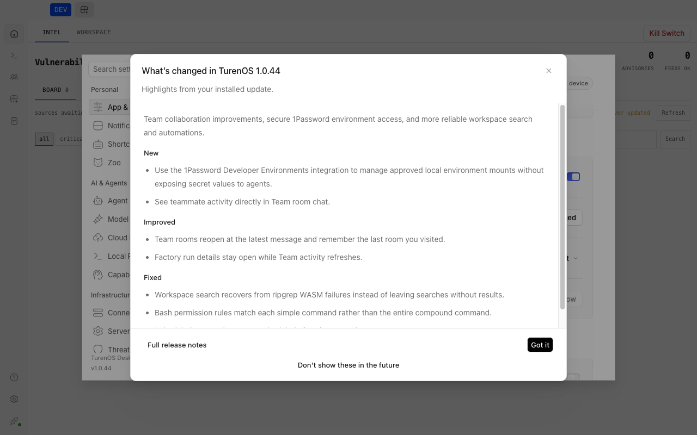

# Desktop storage

The Desktop keeps its settings and window state in the local server's storage rather than in files beside the app. The
one exception is the wrapped credential key, which stays in the `forge.settings` electron-store file (see
[Secure storage](./secure-storage.md#on-disk-locations)). On
first use it imports each older local store exactly once: the Electron `electron-store` files and, beneath them, the
stores left by the earlier Tauri-based desktop app. An import is recorded with a migration receipt on the server, so a
later edit to the old files is never re-imported.

## How it works

1. `createDesktopStorage` (`packages/desktop/src/main/storage/bridge.ts`) maps each named store to a server storage
   scope, `desktop/store/<name>.<hash>`, and serializes mutations per key and per scope.
2. `createDesktopProductStorage` (`packages/desktop/src/main/storage/product.ts`) keeps Desktop product state in the
   `desktop/store/product-state-v1` scope: default server URL, first-launch onboarding, layout eligibility, WSL and SSH
   server lists, pinch zoom, window IDs, updater state, the release-notes version marker, and per-window geometry and last active URL.
3. The first access to a store triggers its import. `importLegacyStore` (named stores) and `importEntries` (product
   state) skip the import when the server already holds its migration receipt; otherwise they write the entries and a
   receipt fingerprinted from the sorted source entries. Named migrations include `desktop.legacy.product-settings.v1` (from `forge.settings`), `desktop.legacy.updater-ready.v1`
   (from `forge.updater`), `desktop.legacy.window-state.v1.*` (from `window-state-*.json`), and
   `desktop.electron-store.*` for other stores.
4. The legacy source for a store is the Electron store merged over the Tauri store (`packages/desktop/src/main/migrate.ts`);
   Electron values win. Tauri stores are the `.dat` files in the Tauri app data directory for the channel's bundle ID:

   | Platform | Tauri data directory                                                  |
   | -------- | --------------------------------------------------------------------- |
   | macOS    | `~/Library/Application Support/<bundle ID>`                           |
   | Windows  | `%APPDATA%\<bundle ID>`                                               |
   | Linux    | `$XDG_DATA_HOME/<bundle ID>`, by default `~/.local/share/<bundle ID>` |

   Bundle IDs are `com.turenlabs.forge`, `com.turenlabs.forge.beta`, and `com.turenlabs.forge.dev`; unpackaged builds use
   the dev ID.

## Release notes after an upgrade

On the first ready launch after a stable upgrade, Desktop shows the bundled **What's changed** summary in one window.
It waits for onboarding and any active dialog, and makes no startup request for release content. Fresh installs,
unchanged versions, and downgrades do not trigger it. Settings > App & Interface > Updates provides both the automatic
release-notes toggle and a **What's changed** button for reopening the summary, including when automatic popups are off.



The main-process coordinator stores `release-notes-version` in `desktop/store/product-state-v1`. It imports the previous
`highlights.v1` version through the existing `default.dat` storage bridge when available, then keeps the highest shown
or explicitly skipped version. Fresh profiles are seeded before onboarding completes. Without a usable legacy version,
an existing profile's missing or empty saved marker starts at `0.0.0`. The profile can then receive the available bundled highlights.
A nonempty malformed saved marker is kept and suppresses automatic release notes.

Only the claiming window can acknowledge an automatic popup, and acknowledgement follows mounting the dialog. Window
teardown releases an unshown claim. A storage failure suppresses automatic notes for that process and allows a later
launch to retry. Failure to save this optional marker does not block shutdown; failures saving other product state
still do. See [release preparation](../operations/releases/README.md#bundle-the-release-notes) for content authoring,
version validation, and retained-history limits.

## Limits

- A Tauri file that cannot be parsed fails the import of that store and is logged; other stores still import.
- An import runs once per migration name; changes to the old files after the receipt is written are ignored.
- The storage lives in the server database, so it follows the database's location and permissions (see
  [Persistence](../architecture/persistence.md)).

## Verification

```sh
cd packages/desktop
bun test src/main/storage src/main/migrate.test.ts
```

## Source

- [`packages/desktop/src/main/storage/bridge.ts`](../../packages/desktop/src/main/storage/bridge.ts)
- [`packages/desktop/src/main/storage/product.ts`](../../packages/desktop/src/main/storage/product.ts)
- [`packages/desktop/src/main/storage/client.ts`](../../packages/desktop/src/main/storage/client.ts)
- [`packages/desktop/src/main/migrate.ts`](../../packages/desktop/src/main/migrate.ts)
- [`packages/desktop/src/main/store-keys.ts`](../../packages/desktop/src/main/store-keys.ts)
- [`packages/desktop/src/main/release-notes.ts`](../../packages/desktop/src/main/release-notes.ts)
- [`packages/app/src/context/highlights.tsx`](../../packages/app/src/context/highlights.tsx)
- [`packages/app/src/components/dialog-release-notes.tsx`](../../packages/app/src/components/dialog-release-notes.tsx)
